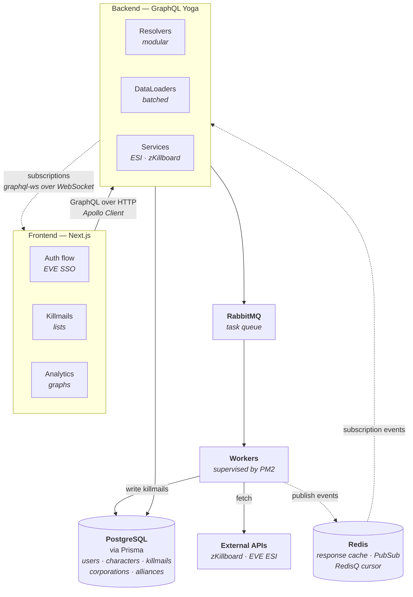

# KillReport

**Modern EVE Online Killmail Tracking & Analytics Platform**

[](https://www.typescriptlang.org/) [](https://nextjs.org/) [](https://graphql.org/) [](https://www.postgresql.org/) [](https://www.prisma.io/) [](https://www.rabbitmq.com/)

[](https://www.digitalocean.com/)

_Track, analyze, and visualize EVE Online killmails with real-time data synchronization_

[Features](#features) • [Quick Start](#quick-start) • [Documentation](#documentation) • [Architecture](#architecture) • [Contributing](#contributing)

---

## Overview

KillReport is a full-stack application built for EVE Online players and corporations to track, monitor, and analyze killmail data. It provides real-time synchronization with zKillboard and EVE ESI APIs, offering comprehensive analytics and a modern, responsive UI.

### Why KillReport?

- **Real-time Sync**: Automated background workers fetch killmails for characters, corporations, and alliances
- **Secure Authentication**: EVE Online SSO integration for seamless login
- **Rich Analytics**: Detailed statistics, filters, and visualizations
- **High Performance**: GraphQL API with DataLoader optimization and Redis caching
- **Scalable**: Distributed job processing with RabbitMQ for horizontal scaling
- **Modern UI**: Built with Next.js 16, React 19, and Tailwind CSS

---

## Features

### Core Functionality

- **EVE SSO Authentication** - Secure login with EVE Online accounts
- **Character Killmail Tracking** - Sync and view killmail history for any character
- **Corporation/Alliance Tracking** - Organization-level killmail aggregation
- **Real-time Updates** - Live killmail feed via GraphQL subscriptions over WebSocket
- **Advanced Filtering** - Filter by date, ship type, system, and more
- **Pagination** - Efficient loading of large datasets
- **Worker Monitoring** - Real-time status dashboard for background jobs

### Technical Highlights

- **Modern Stack**: Next.js 16 (App Router), React 19, TypeScript 5+
- **GraphQL API**: Type-safe API with automatic code generation
- **Database**: PostgreSQL with Prisma ORM and pre-aggregated stats tables
- **Background Jobs**: RabbitMQ-based distributed task queue, run under PM2
- **Subscriptions**: `graphql-ws` over WebSocket, with Redis PubSub for multi-process fan-out
- **External APIs**: Integration with zKillboard and EVE ESI
- **Type Safety**: Full TypeScript coverage across frontend and backend
- **DataLoader**: Optimized database queries to prevent N+1 problems
- **Performance**: Redis response caching and optimized query patterns

---

## Quick Start

### Prerequisites

- Node.js 20+ and Yarn 4 (the repo pins `yarn@4.10.3` via `packageManager`)
- PostgreSQL database
- Redis (response cache, RedisQ stream cursor, subscription PubSub)
- RabbitMQ server (for background workers)
- EVE Online Developer Application ([Create one here](https://developers.eveonline.com/))

### Installation

```bash
# Clone the repository
git clone https://github.com/umutyerebakmaz/killreport.git
cd killreport

# Install dependencies (monorepo)
yarn install

# Setup backend environment
cd backend
cp .env.example .env
# Edit .env with your EVE_CLIENT_ID, EVE_CLIENT_SECRET, DATABASE_URL, etc.

# Setup database
# The Prisma schema is split across backend/prisma/schema/*.prisma
yarn prisma:migrate
yarn prisma:generate

# Setup frontend environment
cd ../frontend
cp .env.example .env.local
# Edit .env.local with NEXT_PUBLIC_GRAPHQL_URL and NEXT_PUBLIC_BACKEND_URL

# Return to root and start development servers
cd ..
yarn dev:backend  # Terminal 1 - Starts on http://localhost:4000
yarn dev:frontend # Terminal 2 - Starts on http://localhost:3000
```

`yarn dev:backend` starts the GraphQL API only. Killmail ingestion, enrichment and
sync run as **separate worker processes** — nothing appears in the database until at
least one of them is running. To get live killmails flowing locally:

```bash
cd backend
yarn worker:redisq   # live zKillboard feed
yarn scan:entities   # queue missing characters/corps/alliances/types
yarn worker:info:characters
```

See the [worker documentation](./backend/docs/workers/worker-documentation.md) for the
full list, and [PM2 operations](./backend/docs/ops/pm2.md) for how they are run in
production.

## Documentation

**→ [Backend documentation index](./backend/docs/README.md)** — the full catalogue:
architecture, authentication, ESI, workers, leaderboards, caching, operations and
deployment. Start there.

The most common entry points:

| Topic | Document |
| --- | --- |
| How the pieces fit together | [Architecture](./backend/docs/architecture.md) |
| EVE SSO login flow | [Auth Setup](./backend/docs/authentication/auth-setup.md) |
| Every worker and queue | [Workers Documentation](./backend/docs/workers/worker-documentation.md) |
| Running the app in production | [Deployment Checklist](./backend/docs/deployment/deployment-checklist.md) |
| Day-to-day operations | [Daily Workflows](./backend/docs/ops/daily.md) · [PM2](./backend/docs/ops/pm2.md) |
| Caching behaviour | [Cache Strategy](./backend/docs/redis-cache/cache-strategy.md) |
| Leaderboard internals | [Leaderboards](./backend/docs/leaderboards/leaderboards.md) |

Component READMEs: [backend](./backend/README.MD) · [frontend](./frontend/README.MD)

Schemas: [Prisma models](./backend/prisma/schema/) · [GraphQL schema](./backend/src/generated-schema.graphql)

---

## Architecture



### Tech Stack

**Frontend:**

- Next.js 16 with App Router
- React 19 with Server Components
- Apollo Client 3 for GraphQL
- `graphql-ws` for subscriptions
- Tailwind CSS 4 for styling
- TypeScript 5+ for type safety

**Backend:**

- GraphQL Yoga (GraphQL Server)
- Prisma ORM with PostgreSQL
- Redis for response caching and subscription PubSub
- RabbitMQ for job queues
- PM2 for process management
- DataLoader for query optimization
- TypeScript with auto-generated types

**External Services:**

- EVE Online ESI API
- zKillboard API
- EVE SSO for authentication

---

## Development

### Project Structure

```text
killreport/
├── frontend/                # Next.js application
│   ├── src/
│   │   ├── app/             # App Router pages
│   │   ├── components/      # React components
│   │   ├── graphql/         # Queries, mutations, subscriptions
│   │   ├── generated/       # Auto-generated GraphQL types & hooks
│   │   ├── hooks/           # Custom React hooks
│   │   └── lib/             # Utilities (Apollo Client, WS link)
│   └── package.json
│
├── backend/                 # GraphQL API server
│   ├── src/
│   │   ├── schemas/         # GraphQL schema files
│   │   ├── resolvers/       # GraphQL resolvers
│   │   ├── services/        # External API integrations
│   │   ├── queues/          # Producers — push jobs onto RabbitMQ
│   │   ├── workers/         # Consumers — background job workers
│   │   ├── plugins/         # Yoga plugins (rate limiting, cache)
│   │   ├── config/          # Env validation and cache config
│   │   └── server.ts        # GraphQL Yoga server
│   ├── prisma/
│   │   └── schema/          # Database schema, split per model
│   ├── docs/                # Backend documentation (see index)
│   └── package.json
│
├── ecosystem.config.js      # PM2 process definitions (API + workers)
└── package.json             # Monorepo root
```

### Available Scripts

**Root Level (Monorepo):**

```bash
yarn dev              # Start frontend dev server
yarn dev:frontend     # Start frontend on port 3000
yarn dev:backend      # Start backend on port 4000
yarn remove:all       # Wipe all node_modules, lockfiles and .next
```

**Frontend:**

```bash
yarn dev              # Start Next.js dev server
yarn build            # Production build
yarn codegen          # Generate Apollo Client hooks
```

**Backend:** the backend has ~80 scripts (queues, workers, snapshots, Prisma).
See the [backend README](./backend/README.MD) for the catalogue.

---

## Configuration

### Backend Environment Variables

Copy `backend/.env.example` to `backend/.env`. Variables are validated on boot by
`backend/src/config/config.ts` — the server exits with a readable error if a
required one is missing.

| Variable | Required | Default | Purpose |
| --- | --- | --- | --- |
| `DATABASE_URL` | yes | — | PostgreSQL connection string |
| `EVE_CLIENT_ID` | yes | — | EVE SSO application ID |
| `EVE_CLIENT_SECRET` | yes | — | EVE SSO application secret |
| `EVE_CALLBACK_URL` | no | `http://localhost:4000/auth/callback` | Must match the EVE application |
| `FRONTEND_URL` | no | `http://localhost:3000` | Post-login redirect target |
| `RABBITMQ_URL` | no | `amqp://localhost` | Job queue connection |
| `REDIS_URL` | no | — | Response cache, RedisQ cursor, PubSub |
| `USE_REDIS_PUBSUB` | no | — | Fan subscriptions out across processes |
| `JWT_SECRET` | no | — | Session token signing key |
| `PORT` | no | `4000` | API port |
| `NODE_ENV` | no | `development` | `development` \| `production` \| `test` |
| `LOG_LEVEL` | no | `info` | `error` \| `warn` \| `info` \| `http` \| `debug` |
| `GRAPHQL_INTROSPECTION` | no | `true` | Disable in production |
| `GRAPHQL_PLAYGROUND` | no | `true` | Disable in production |
| `REDISQ_ENABLE_ENRICHMENT` | no | — | Enrich entities inline in the RedisQ worker |

### Frontend Environment Variables

Copy `frontend/.env.example` to `frontend/.env.local`:

```env
NEXT_PUBLIC_GRAPHQL_URL="http://localhost:4000/graphql"
NEXT_PUBLIC_BACKEND_URL="http://localhost:4000"
```

`NEXT_PUBLIC_BACKEND_URL` is used by the EVE SSO callback page. The WebSocket
subscription endpoint is derived from `NEXT_PUBLIC_GRAPHQL_URL` by swapping
`http`/`https` for `ws`/`wss`, so it needs no separate variable.

---

## Testing

There is no automated test suite yet — this is the largest open gap in the project
and a good place to contribute.

To exercise the API by hand, visit `http://localhost:4000/graphql` for the GraphQL
Playground (enabled while `GRAPHQL_PLAYGROUND` is `true`).

---

## Contributing

Contributions are welcome. See **[CONTRIBUTING.md](./.github/CONTRIBUTING.md)** for
the workflow, coding conventions and commit message format.

- Found a bug? [Open a bug report](./.github/ISSUE_TEMPLATE/bug_report.md)
- Have an idea? [Open a feature request](./.github/ISSUE_TEMPLATE/feature_request.md)
- Spotted a documentation problem? [Open a documentation issue](./.github/ISSUE_TEMPLATE/documentation.md)
- Security issue? Please follow the [security policy](./.github/SECURITY.md) instead of opening a public issue.

Participation is governed by our [Code of Conduct](./.github/CODE_OF_CONDUCT.md).

### Areas that need help most

- **Test coverage** — there is currently none
- **Frontend documentation** — component and data-flow conventions
- Bug fixes and issue resolution
- Performance optimizations
- UI/UX enhancements
- Internationalization

---

## License

This project is open source and available under the [MIT License](LICENSE).

---

## Acknowledgments

- **[EVE Online](https://www.eveonline.com/)** - For the amazing game and APIs
- **[zKillboard](https://zkillboard.com/)** - For providing public killmail data
- **[CCP Games](https://www.ccpgames.com/)** - For the EVE ESI API

---

## Support & Contact

- **Issues**: [GitHub Issues](https://github.com/umutyerebakmaz/killreport/issues)
- **Discussions**: [GitHub Discussions](https://github.com/umutyerebakmaz/killreport/discussions)
- **In-Game Contact**: General XAN (EVE Online character)
  - Feel free to send ISK, feedback, or questions in-game
  - All donations and feedback are appreciated!

---

**Made with ❤️ for the EVE Online community**
