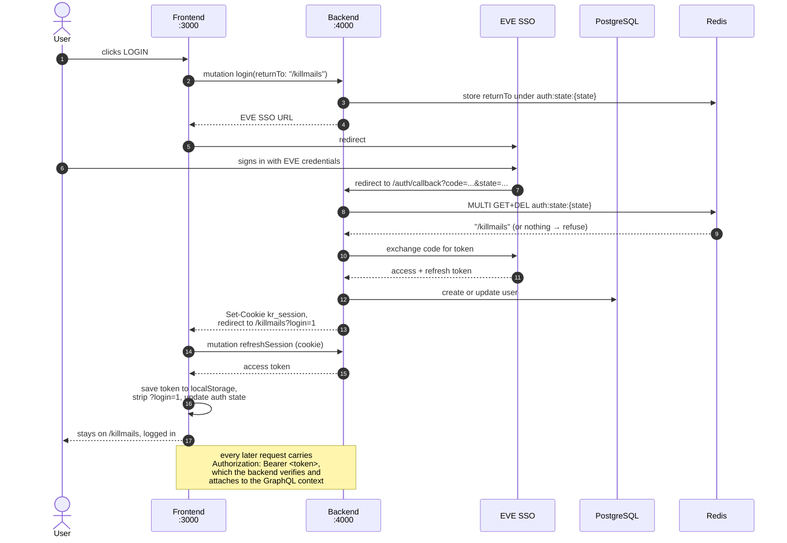

# Authentication Flow - Complete Setup Guide

## Overview

This project uses Eve Online SSO authentication. Users can log in with their Eve Online accounts and access killmail data.

## Architecture

### Flow Diagram



## Components

### Backend (Port 4000)

**Server**: `/root/killreport/backend/src/server.ts`

- GraphQL endpoint: `/graphql`
- SSO callback endpoint: `/auth/callback`

**Services**:

- `eve-sso.ts`: Eve Online SSO integration
- GraphQL context middleware: Verifies Bearer token

**Resolvers**: `auth.resolver.ts`

- `login`: Generate SSO URL
- `authenticateWithCode`: Exchange code for token
- `me`: Get current user info

### Frontend (Port 3000)

**Apollo Client**: `/root/killreport/frontend/src/lib/apolloClient.ts`

- Automatically adds Authorization header from localStorage

**Pages**:

- `/auth/callback`: only reached when the registered EVE callback URL points at
  the frontend domain; forwards `code` and `state` to the backend and renders
  nothing. There is no success page — the round trip ends on the page the user
  pressed LOGIN on.

**Components**:

- `AuthButton`: Smart login/logout button
- `Header`: Shows user info when logged in

**Hooks**:

- `useAuth`: Auth state management

## Setup

### 1. Backend Environment Variables

Create `/root/killreport/backend/.env`:

```env
EVE_CLIENT_ID=your_client_id_here
EVE_CLIENT_SECRET=your_secret_key_here
EVE_CALLBACK_URL=http://localhost:4000/auth/callback
FRONTEND_URL=http://localhost:3000
```

### 2. Eve Developer Application

1. Go to https://developers.eveonline.com/
2. Create new application:
   - **Callback URL**: `http://localhost:4000/auth/callback`
   - **Scopes**: Select required permissions
3. Copy Client ID and Secret to `.env`

### 3. Start Services

```bash
# Terminal 1: Backend
cd /root/killreport/backend
yarn dev

# Terminal 2: Frontend
cd /root/killreport/frontend
yarn dev
```

### 4. Test Authentication

1. Open http://localhost:3000
2. Click **LOGIN** button in header
3. Login with Eve Online
4. You'll be redirected back and see your character name
5. Click **LOGOUT** to sign out

## How It Works

### Login Process

```typescript
// 1. User clicks LOGIN
<AuthButton />; // calls handleLogin()

// 2. Get SSO URL from backend, remembering where we are
const { data } = await loginMutation({
  variables: { returnTo: window.location.pathname + window.location.search },
});
window.location.href = data.login.url;

// 3. User logs in at Eve SSO
// Eve redirects to: http://localhost:4000/auth/callback?code=xxx&state=yyy

// 4. Backend spends the state, then exchanges the code
const returnTo = await consumeAuthState(state); // null → refuse, no exchange
const tokenData = await exchangeCodeForToken(code);
const character = await verifyToken(tokenData.access_token);

// 5. Backend sets the session cookie and sends the browser back where it was.
// Nothing sensitive is in the URL.
res.writeHead(302, {
  "Set-Cookie": serializeSessionCookie(sessionToken, { secure: isProduction }),
  Location: `http://localhost:3000/killmails?login=1`,
});

// 6. useAuth sees ?login=1, removes it from the address bar and swaps the
// cookie for an access token
localStorage.setItem("eve_access_token", accessToken);
window.dispatchEvent(new Event("auth-change"));
```

### Authenticated Requests

```typescript
// Apollo Client automatically adds header:
headers: {
  authorization: `Bearer ${localStorage.getItem('eve_access_token')}`;
}

// Backend verifies and adds user to context:
const character = await verifyToken(token);
return { user: character };

// Use in resolvers:
me: async (_, __, context) => {
  if (!context.user) {
    throw new Error('Not authenticated');
  }
  // Access user data: context.user.characterId
};
```

## Security Notes

- Tokens stored in localStorage (survives page refresh)
- Token expiry checked on mount
- CSRF protection via state parameter
- Tokens verified on backend for each request

## Troubleshooting

### "Not authenticated" errors

- Check if token exists: `localStorage.getItem('eve_access_token')`
- Check token expiry: `localStorage.getItem('eve_token_expiry')`
- Try logging out and back in

### Redirect issues

- Verify `FRONTEND_URL` in backend `.env`
- Check Eve application callback URL matches

### CORS errors

- Backend server.ts already has CORS headers
- Make sure both servers are running

## Development Tips

### Check Current Auth State

```javascript
// In browser console:
localStorage.getItem('eve_access_token');
localStorage.getItem('eve_user');
```

### Clear Auth State

```javascript
// In browser console:
localStorage.clear();
location.reload();
```

### Test Protected Query

You can test the following query in the GraphQL Yoga Playground at [http://localhost:4000/graphql](http://localhost:4000/graphql)

```graphql
query {
  me {
    id
    name
    email
  }
}
```

This should work when logged in, and fail when logged out.
