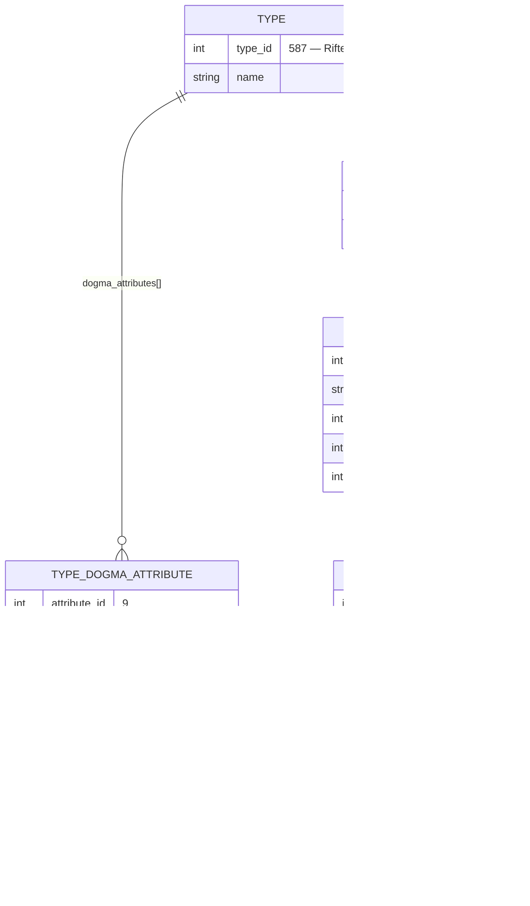

# EVE ESI Type Dogma Hierarchy

## Top Level: Type

```http
GET /universe/types/{type_id}/
```

### Type Object Structure

```json
{
  "type_id": 587,
  "name": "Rifter",
  "description": "...",
  "group_id": 25,
  "market_group_id": 61,
  "dogma_attributes": [
    // ← Attributes belonging to Type
    {
      "attribute_id": 9,
      "value": 1.0
    }
  ],
  "dogma_effects": [
    // ← Effects belonging to Type
    {
      "effect_id": 11,
      "is_default": true
    }
  ]
}
```

---

## Level 2A: Dogma Attribute (Referenced in Type)

```http
GET /dogma/attributes/{attribute_id}/
```

### Dogma Attribute Object

```json
{
  "attribute_id": 9,
  "name": "mass",
  "display_name": "Mass",
  "description": "The mass of the item",
  "unit_id": 1, // ← Unit reference
  "icon_id": 0,
  "default_value": 0.0,
  "published": true,
  "stackable": true,
  "high_is_good": false
}
```

**Relation**: Type → dogma_attributes[].attribute_id → Dogma Attribute

---

## Level 2B: Dogma Effect (Referenced in Type)

```http
GET /dogma/effects/{effect_id}/
```

### Dogma Effect Object

```json
{
  "effect_id": 11,
  "name": "loPower",
  "display_name": "Low power",
  "description": "...",
  "effect_category": 0,
  "pre_expression": 131, // ← Expression reference
  "post_expression": 132, // ← Expression reference
  "icon_id": 0,
  "published": true,
  "modifiers": [
    // ← Attributes modified by effect
    {
      "domain": "shipID",
      "func": "ItemModifier",
      "modified_attribute_id": 6, // ← Attribute reference
      "modifying_attribute_id": 9, // ← Attribute reference
      "operator": 6
    }
  ]
}
```

**Relation**: Type → dogma_effects[].effect_id → Dogma Effect

---

## Complete Hierarchy Visualization

The important thing to see is that a type never stores attribute or effect
*definitions* — it stores IDs plus a per-type value, and the definitions live in
their own tables. Effect modifiers then point back at attributes, which is what
closes the loop:



Read the cycle as: `Rifter → effect 11 (loPower) → modifier → attribute 9 (mass)`.
An effect attached to one type reaches back and changes attributes, which is why
enrichment has to resolve effects and attributes together rather than separately.

---

## Data Flow Example

### 1. Fetch Type Info

```http
GET /universe/types/587/
```

**Response**: Rifter with `dogma_attributes` and `dogma_effects` arrays

### 2. Fetch Attribute Details

```http
GET /dogma/attributes/9/    # Mass attribute
GET /dogma/attributes/38/   # Capacity attribute
```

### 3. Fetch Effect Details

```http
GET /dogma/effects/11/      # loPower effect
GET /dogma/effects/132/     # Some other effect
```

### 4. Cross-Reference in Effect Modifiers

Effect 11's modifiers may reference:

- `modified_attribute_id: 6` → Fetch `/dogma/attributes/6/`
- `modifying_attribute_id: 9` → Already fetched (mass)

---

## Database Schema Equivalent (KillReport Project)

### Current Implementation (JSON Storage)

```prisma
model Type {
  id              Int     @id
  name            String
  description     String?
  groupId         Int

  // JSON fields to store arrays
  dogmaAttributes Json?   // Stores attribute_id + value pairs
  dogmaEffects    Json?   // Stores effect_id + is_default pairs
}
```

### Future Enhancement (Normalized)

```prisma
model DogmaAttribute {
  id           Int     @id
  name         String
  displayName  String?
  unitId       Int?
  defaultValue Float

  // Many-to-many with Types
  typeAttributes TypeDogmaAttribute[]
}

model DogmaEffect {
  id            Int     @id
  name          String
  displayName   String?
  effectCategory Int
  modifiers     Json    // Stores modifier array

  // Many-to-many with Types
  typeEffects   TypeDogmaEffect[]
}

model TypeDogmaAttribute {
  type         Type            @relation(...)
  typeId       Int
  attribute    DogmaAttribute  @relation(...)
  attributeId  Int
  value        Float

  @@id([typeId, attributeId])
}

model TypeDogmaEffect {
  type       Type         @relation(...)
  typeId     Int
  effect     DogmaEffect  @relation(...)
  effectId   Int
  isDefault  Boolean

  @@id([typeId, effectId])
}
```

---

## Key Relationships

1. **Type → Attributes**: One-to-Many (Type has multiple attributes with values)
2. **Type → Effects**: One-to-Many (Type has multiple effects)
3. **Effect → Attributes**: Many-to-Many (Effects modify attributes via modifiers)
4. **Attribute → Unit**: Many-to-One (Attributes have display units)

---

## ESI Endpoints Summary

| Entity          | Endpoint                 | Returns                       |
| --------------- | ------------------------ | ----------------------------- |
| Type            | `/universe/types/{id}`   | Full type info + dogma refs   |
| Dogma Attribute | `/dogma/attributes/{id}` | Attribute definition          |
| Dogma Effect    | `/dogma/effects/{id}`    | Effect definition + modifiers |
| All Attributes  | `/dogma/attributes/`     | List of all attribute IDs     |
| All Effects     | `/dogma/effects/`        | List of all effect IDs        |

---

## Understanding the System

This hierarchy defines how items work in EVE Online (fitting bonuses, module effects, ship characteristics):

- **Dogma Attributes**: Numerical values (mass, volume, damage, capacitor, etc.)
- **Dogma Effects**: Define how these values are modified (bonuses, penalties, skill effects)

### Real-World Example: Shield Booster Module

1. **Type**: Medium Shield Booster I (type_id: 3841)
2. **Attributes**:
   - `shieldBonus` (attribute_id: 68): Amount of shield HP restored
   - `duration` (attribute_id: 73): Cycle time
   - `capacitorNeed` (attribute_id: 6): Capacitor usage per cycle
3. **Effects**:
   - `shieldBoosting` (effect_id: 4): Applies shield HP restoration
   - `onlineEffect` (effect_id: 16): Module can be onlined

### Implementation Strategy

For KillReport, dogma data is useful for:

- Displaying module stats on killmail items
- Showing ship base stats
- Calculating fitting information
- Understanding weapon/damage types

Currently stored as JSON for simplicity. Can be normalized later if complex queries are needed.
