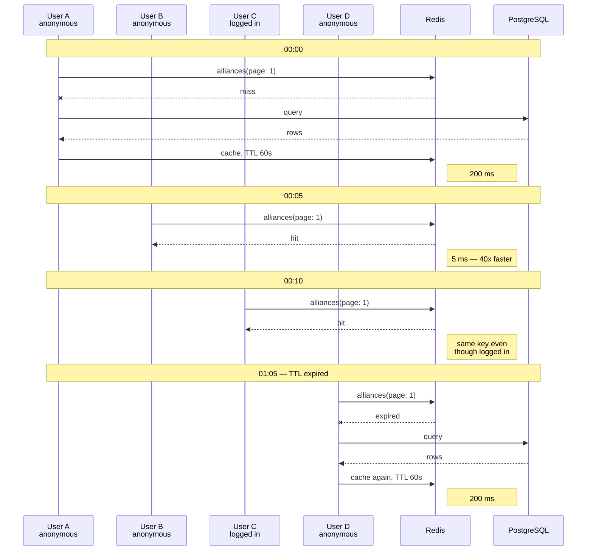

# GraphQL Response Cache Strategy

## 🎯 Cache Key Logic

### How It Works

The cache key is determined by:

1. **Session identifier** (user-specific or public)
2. **GraphQL query hash** (operation + variables)

**Formula**: `cache_key = session + query_hash`

---

## 📋 Cache Strategies

### 1. Public Cache (Shared)

**Queries that return the same data for all users:**

```graphql
# All users see the same alliance list
query Alliances {
  alliances(page: 1, limit: 25) {
    edges {
      node {
        name
        ticker
      }
    }
  }
}
```

**Cache Key**: `public:{query-hash}`

**Result**:

- ✅ User A requests → Cache miss → DB query → Cache stored
- ✅ User B requests → **Cache hit** → No DB query
- ✅ User C requests → **Cache hit** → No DB query

**Memory Efficient**: 1 cache entry for unlimited users

---

### 2. User-Specific Cache (Private)

**Queries that return different data per user:**

```graphql
# Each user has their own killmails
query MyKillmails {
  me {
    id
    killmails {
      edges {
        node {
          killmail_id
        }
      }
    }
  }
}
```

**Cache Key**: `{user-token}:{query-hash}`

**Result**:

- ✅ User A requests → Cache key: `abc12345:{query}`
- ✅ User B requests → Cache key: `xyz67890:{query}` (different!)
- Each user gets their own cached data

---

## 🔄 Cache Flow Example

### Scenario: Alliance List Query

Every request below uses the same cache key,
`public:alliances-page1-limit25` — note that logging in does not change it.



---

## 📊 Public vs Private Queries

### Public Queries (Shared Cache)

| Query                         | Reason                   | TTL |
| ----------------------------- | ------------------------ | --- |
| `Alliances`                   | Same for everyone        | 60s |
| `Corporations`                | Same for everyone        | 60s |
| `Characters`                  | Same for everyone        | 60s |
| `Killmails`                   | Public feed              | 60s |
| `KillmailDetails`             | Immutable once created   | 60s |
| `AllianceDetails`             | Stats don't change often | 60s |
| `CorporationDetails`          | Stats don't change often | 60s |
| `Regions`, `Systems`, `Types` | Static game data         | 60s |

### Private Queries (User-Specific Cache)

| Query                       | Reason                | TTL |
| --------------------------- | --------------------- | --- |
| `me`                        | User-specific data    | 60s |
| `myKillmails`               | User's personal kills | 60s |
| `myCharacters`              | User's characters     | 60s |
| Any query with auth context | User-specific results | 60s |

---

## 🎯 Benefits

### Before (Session-Based for Everything)

```
100 users request alliances
├─ 100 separate cache entries
├─ 100 × 200 KB = 20 MB wasted
└─ Each user generates their own cache
```

### After (Public Cache for Public Data)

```
100 users request alliances
├─ 1 shared cache entry
├─ 1 × 200 KB = 200 KB used
└─ 99% cache hit rate
```

**Memory Savings**: 100x reduction for public queries!

---

## 🔍 How to Check Cache Behavior

### Test Cache Hit/Miss

```bash
# Start with empty cache
redis-cli FLUSHALL

# First request (cache miss)
curl -X POST http://localhost:4000/graphql \
  -H "Content-Type: application/json" \
  -d '{"query":"query Alliances { alliances(page:1,limit:25) { edges { node { name } } } }","operationName":"Alliances"}'

# Check cache
redis-cli KEYS "*"
# Should show: public:*

# Second request (cache hit - should be much faster)
curl -X POST http://localhost:4000/graphql \
  -H "Content-Type: application/json" \
  -d '{"query":"query Alliances { alliances(page:1,limit:25) { edges { node { name } } } }","operationName":"Alliances"}'

# Check Redis stats
redis-cli INFO stats | grep keyspace_hits
```

---

## 🚨 Important Notes

### Cache Invalidation

Cache automatically expires after TTL (60 seconds). For manual invalidation:

```bash
# Clear all cache
redis-cli FLUSHALL

# Clear specific pattern
redis-cli KEYS "public:alliances*" | xargs redis-cli DEL
```

### Operation Names Matter

**Always specify `operationName` in frontend queries:**

```typescript
// ✅ Good - will use public cache
const { data } = useAlliancesQuery({
  variables: { page: 1, limit: 25 },
});

// Generated query includes:
// operationName: "Alliances"

// ❌ Bad - anonymous queries might not cache correctly
const { data } = useQuery(gql`
  query { alliances { ... } }
`);
```

### Cache Warming

Don't pre-warm cache. Let it build naturally:

1. First user hits endpoint → Cache miss → Store
2. Next users → Cache hit → Fast response
3. After TTL expires → Next user refreshes cache
4. Cycle repeats

---

## 📈 Monitoring

### Check Cache Efficiency

```bash
# Hit rate
redis-cli INFO stats | grep -E "keyspace_hits|keyspace_misses"

# Memory usage
redis-cli INFO memory | grep used_memory_human

# Top keys
redis-cli --bigkeys
```

### Expected Metrics After Warmup

- **Hit Rate**: >80%
- **Memory Usage**: 100-300 MB
- **Avg Response Time**: <50ms (cached) vs 200ms (uncached)

---

## ✅ Summary

### Current Behavior (After Fix)

| User Type | Query Type    | Cache Behavior                       |
| --------- | ------------- | ------------------------------------ |
| Anonymous | Public query  | ✅ Shared cache (`public:*`)         |
| Logged in | Public query  | ✅ Shared cache (`public:*`)         |
| Logged in | Private query | 🔒 User-specific cache (`{token}:*`) |

### Memory Impact

- **Before**: 100 users × 200 KB = 20 MB per query
- **After**: 1 × 200 KB = 200 KB per query (100x reduction!)

**Result**: Much better memory efficiency while maintaining security! 🚀
