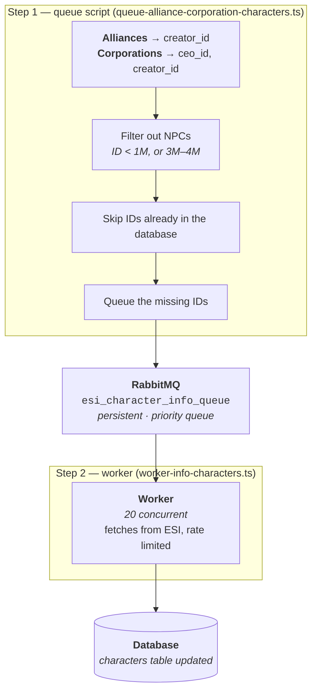

# Alliance-Corporation-Character Enrichment System

## 📚 Overview

This system automatically enriches the `characters` table by collecting character IDs from `alliances` and `corporations` tables and fetching their information from ESI (EVE Swagger Interface).

## 🎯 Purpose

Alliance and Corporation tables contain character IDs (creators, CEOs) that may not exist in the `characters` table. This system:

- Collects these character IDs
- Filters out NPCs
- Checks existing characters
- Queues missing characters
- Fetches their data from ESI
- Saves to database

---

## 🔄 System Architecture



---

## 📋 Character IDs Collected

### From `alliances` Table

| Field        | Description                        | Example  |
| ------------ | ---------------------------------- | -------- |
| `creator_id` | Character who created the alliance | 95465499 |

### From `corporations` Table

| Field        | Description                           | Example  |
| ------------ | ------------------------------------- | -------- |
| `ceo_id`     | Current CEO of the corporation        | 12345678 |
| `creator_id` | Character who created the corporation | 87654321 |

**Note:** All IDs are Character IDs, not Corporation IDs.

---

## 🚀 Usage Guide

### Step 1: Queue Character IDs

```bash
cd backend
yarn queue:alliance-corp-characters
```

#### What it does

1. Fetches all alliances and corporations from database
2. Collects unique character IDs (creator_id, ceo_id)
3. Filters out NPC characters:
   - ID < 1,000,000
   - ID between 3,000,000 and 4,000,000
4. Checks which characters already exist in database
5. Queues only missing characters to RabbitMQ

#### Expected Output

```bash
🤝 Alliance-Corporation Character Queue Script Started
━━━━━━━━━━━━━━━━━━━━━━━━━━━━━━━━━━━━━━━━━━━━━━━━━━━━━━━━━━━━━━━━
📊 Fetching data from database...
✅ Found 245 alliances
✅ Found 1523 corporations

✅ Collected 1200 unique character IDs (NPCs filtered)
━━━━━━━━━━━━━━━━━━━━━━━━━━━━━━━━━━━━━━━━━━━━━━━━━━━━━━━━━━━━━━━━
🔍 Checking for existing characters in database...
✅ 800 characters already exist
✅ 400 characters need enrichment
━━━━━━━━━━━━━━━━━━━━━━━━━━━━━━━━━━━━━━━━━━━━━━━━━━━━━━━━━━━━━━━━
✅ Connected to RabbitMQ
📦 Queue: esi_character_info_queue

📤 Adding characters to queue...
  ✅ Batch 1/4: 100 characters queued
  ✅ Batch 2/4: 100 characters queued
  ✅ Batch 3/4: 100 characters queued
  ✅ Batch 4/4: 100 characters queued

━━━━━━━━━━━━━━━━━━━━━━━━━━━━━━━━━━━━━━━━━━━━━━━━━━━━━━━━━━━━━━━━
✅ Successfully queued 400 characters!
━━━━━━━━━━━━━━━━━━━━━━━━━━━━━━━━━━━━━━━━━━━━━━━━━━━━━━━━━━━━━━━━

💡 Statistics:
   📊 Total unique IDs collected: 1200
   ✅ Already in database: 800
   📤 Queued for enrichment: 400
   📦 Total messages in queue: 51924

💡 Next Step:
   Start worker: yarn worker:info:characters
```

---

### Step 2: Start Worker

```bash
yarn worker:info:characters
```

#### What it does

1. Connects to RabbitMQ queue
2. Processes 20 characters concurrently (configurable)
3. For each character:
   - Checks if already exists (skip if yes)
   - Fetches character info from ESI
   - Saves to database
   - Acknowledges message
4. Handles errors:
   - 404 errors → Character deleted, acknowledge and skip
   - Other errors → Requeue for retry

#### Expected Output

```bash
👤 Character Info Worker Started
📦 Queue: esi_character_info_queue
⚡ Prefetch: 20 concurrent

✅ Connected to RabbitMQ
⏳ Waiting for characters...

  ✅ [1] Umut Yerebakmaz
  ✅ [2] John Doe
  - [3] Character 12345678 (exists)
  ! [4] Character 99999999 (404 - Deleted)
  ✅ [5] Jane Smith
  ✅ [6] Bob Wilson
  ...

📊 Summary: 50 processed (45 added, 3 skipped, 2 errors)
📊 Summary: 100 processed (92 added, 6 skipped, 2 errors)
...

━━━━━━━━━━━━━━━━━━━━━━━━━━━━━━━━━━━━━━━━━━━━━━━━━━━━
✅ Queue completed!
📊 Final: 400 processed (380 added, 15 skipped, 5 errors)
━━━━━━━━━━━━━━━━━━━━━━━━━━━━━━━━━━━━━━━━━━━━━━━━━━━━

⏳ Waiting for new messages...
```

**Note:** Worker runs as a daemon - it stays active waiting for new messages.

---

## ⚙️ Configuration

### Queue Script Configuration

**File:** `/backend/src/workers/queue-alliance-corporation-characters.ts`

```typescript
const QUEUE_NAME = 'esi_character_info_queue';
const BATCH_SIZE = 100; // Queue messages in batches of 100

interface EntityQueueMessage {
  entityId: number; // Character ID
  queuedAt: string; // Timestamp
  source: string; // 'alliance_corporation_characters'
}
```

### Worker Configuration

**File:** `/backend/src/workers/worker-info-characters.ts`

```typescript
const QUEUE_NAME = 'esi_character_info_queue';
const PREFETCH_COUNT = 20; // Process 20 characters concurrently
```

#### Performance Tuning

| PREFETCH_COUNT | Speed      | Risk      | Recommendation           |
| -------------- | ---------- | --------- | ------------------------ |
| 10             | Slow       | Very Safe | Default conservative     |
| 20             | Medium     | Safe      | **Current setting** ✅   |
| 30             | Fast       | Safe      | Good for bulk operations |
| 40             | Very Fast  | Moderate  | Maximum recommended      |
| 50+            | Ultra Fast | High      | May hit rate limits      |

**To change:**

```typescript
// In worker-info-characters.ts
const PREFETCH_COUNT = 30; // Increase for faster processing
```

---

## 🔒 Rate Limiting

### ESI Rate Limits

- **ESI Official Limit:** 150 requests/second
- **Our Conservative Limit:** 100 requests/second
- **Worker Rate:** 50 requests/second per instance

### Rate Limiter Implementation

**File:** `/backend/src/services/rate-limiter.ts`

```typescript
class RateLimiter {
  maxRequestsPerSecond = 100; // Global limit
  minDelayBetweenRequests = 20; // 20ms = 50 req/sec
}
```

### Safety Features

- ✅ Queue-based request management
- ✅ Automatic window reset (1 second)
- ✅ Minimum delay between requests
- ✅ Wait until next window if limit reached
- ✅ No manual intervention needed

---

## 📊 Monitoring & Statistics

### Real-time Monitoring

**Worker Statistics:**

```
📊 Summary: 150 processed (140 added, 8 skipped, 2 errors)
```

| Metric        | Description                            |
| ------------- | -------------------------------------- |
| **processed** | Total characters processed             |
| **added**     | New characters saved to database       |
| **skipped**   | Characters already in database         |
| **errors**    | Failed operations (404, network, etc.) |

### Queue Status

Check queue depth at any time:

```bash
yarn queue:alliance-corp-characters
```

Output includes:

```
📦 Total messages in queue: 51924
```

---

## 🔧 Error Handling

### Error Types

#### 1. 404 Errors (Expected)

```
! [124] Character 87654321 (404 - Deleted)
```

- **Cause:** Character deleted from EVE Online
- **Action:** Acknowledge and skip (no retry)
- **Impact:** Normal operation

#### 2. Network Errors (Retry)

```
× [125] Character 12345678 ERROR:
   Message: Failed to fetch character info: 500
   Stack: Error: Failed to fetch character info: 500
```

- **Cause:** ESI temporarily down, network issues
- **Action:** Requeue for automatic retry
- **Impact:** Will be processed again

#### 3. Rate Limit (Auto-handled)

- **Cause:** Too many requests
- **Action:** Rate limiter automatically slows down
- **Impact:** None (transparent to user)

### Error Recovery

**Automatic Retry Logic:**

```typescript
if (error.message?.includes('404')) {
  channel.ack(msg); // Skip deleted characters
} else {
  channel.nack(msg, false, true); // Requeue for retry
}
```

---

## 🗂️ Database Schema

### Characters Table

```sql
CREATE TABLE characters (
  id              INTEGER PRIMARY KEY,
  name            VARCHAR NOT NULL,
  corporation_id  INTEGER NOT NULL,
  alliance_id     INTEGER,
  birthday        TIMESTAMP NOT NULL,
  bloodline_id    INTEGER NOT NULL,
  race_id         INTEGER NOT NULL,
  gender          VARCHAR NOT NULL,
  security_status FLOAT,
  description     TEXT,
  title           TEXT,
  faction_id      INTEGER,
  created_at      TIMESTAMP DEFAULT NOW(),
  updated_at      TIMESTAMP DEFAULT NOW()
);
```

### Data Saved from ESI

| Field           | Type     | Source                      |
| --------------- | -------- | --------------------------- |
| id              | Integer  | Character ID                |
| name            | String   | Character name              |
| corporation_id  | Integer  | Current corp                |
| alliance_id     | Integer? | Current alliance (nullable) |
| birthday        | DateTime | Character creation date     |
| bloodline_id    | Integer  | EVE bloodline               |
| race_id         | Integer  | EVE race                    |
| gender          | String   | Male/Female                 |
| security_status | Float?   | Security status             |
| description     | String?  | Bio text                    |
| title           | String?  | In-game title               |
| faction_id      | Integer? | Faction affiliation         |

---

## 📝 Package.json Scripts

```json
{
  "scripts": {
    "queue:alliance-corp-characters": "ts-node src/workers/queue-alliance-corporation-characters.ts",
    "worker:info:characters": "ts-node src/workers/worker-info-characters.ts"
  }
}
```

### Script Descriptions

| Script                           | Purpose                      | When to Use                      |
| -------------------------------- | ---------------------------- | -------------------------------- |
| `queue:alliance-corp-characters` | Add character IDs to queue   | After adding new alliances/corps |
| `worker:info:characters`         | Process queue and fetch data | Runs continuously (daemon)       |

---

## 🎯 Use Cases

### When to Run This System

1. **Initial Setup**

   ```bash
   yarn queue:alliance-corp-characters
   yarn worker:info:characters
   ```

   - First time setting up the database
   - After importing alliance/corporation data

2. **Regular Maintenance**

   ```bash
   # Run weekly or after bulk imports
   yarn queue:alliance-corp-characters
   ```

   - Worker already running will process new additions
   - Keeps character data fresh

3. **After Data Import**

   ```bash
   # After running alliance/corporation enrichment
   yarn queue:alliance-corp-characters
   ```

   - New CEOs and creators need character data
   - Updates relationships

4. **Manual Enrichment**

   ```bash
   # Check and fill missing characters
   yarn queue:alliance-corp-characters
   ```

   - On-demand character data updates
   - Fill gaps in existing data

---

## 🔍 Troubleshooting

### Issue: "Queue is empty" message appears

**Symptom:**

```
✅ Queue completed!
⏳ Waiting for new messages...
```

**Solution:** This is **normal behavior**! Worker is waiting for new messages. Not an error.

---

### Issue: Too many 404 errors

**Symptom:**

```
! [10] Character 123 (404 - Deleted)
! [15] Character 456 (404 - Deleted)
! [22] Character 789 (404 - Deleted)
```

**Cause:** Characters deleted from EVE Online (biomassed, etc.)

**Solution:** No action needed. These are automatically skipped.

---

### Issue: Worker is slow

**Symptom:** Only processing 1-2 characters per second

**Solution:**

```typescript
// Edit worker-info-characters.ts
const PREFETCH_COUNT = 30; // Increase from 20 to 30
```

**Restart worker:**

```bash
# Ctrl+C to stop
yarn worker:info:characters
```

---

### Issue: Network errors

**Symptom:**

```
× [50] Character 12345678 ERROR:
   Message: Failed to fetch character info: 500
```

**Cause:** ESI temporarily unavailable or network issues

**Solution:**

- No action needed - messages are automatically requeued
- Worker will retry them later
- If persistent, check ESI status: <https://esi.evetech.net/>

---

### Issue: Rate limit warnings

**Symptom:** Worker seems to pause frequently

**Cause:** Hitting rate limits

**Solution:**

```typescript
// Decrease PREFETCH_COUNT
const PREFETCH_COUNT = 15; // Lower from 20
```

---

## 💡 Best Practices

### 1. Initial Setup

```bash
# Run once to populate queue
yarn queue:alliance-corp-characters

# Start worker (keeps running)
yarn worker:info:characters
```

### 2. Regular Maintenance

```bash
# Weekly: Check for new characters
yarn queue:alliance-corp-characters

# Worker already running will process them
```

### 3. Performance Optimization

- Start with `PREFETCH_COUNT = 20`
- Monitor worker logs
- Increase if stable, decrease if errors
- Max recommended: 40

### 4. Monitoring

- Watch worker logs for error patterns
- Check queue depth periodically
- Normal 404 rate: 1-5% of total

### 5. Error Management

- 404 errors are normal (deleted characters)
- Network errors will retry automatically
- Stop worker only when queue is completely empty

---

## 📈 Performance Metrics

### Expected Processing Speed

| Configuration     | Characters/Second | Time for 1000 chars |
| ----------------- | ----------------- | ------------------- |
| PREFETCH_COUNT=10 | ~8-10             | ~2 minutes          |
| PREFETCH_COUNT=20 | ~15-18            | ~60 seconds         |
| PREFETCH_COUNT=30 | ~22-25            | ~40 seconds         |
| PREFETCH_COUNT=40 | ~28-32            | ~30 seconds         |

**Factors affecting speed:**

- ESI response time
- Database write speed
- Network latency
- Percentage of existing characters (skipped)

---

## 🔗 Related Systems

### Dependencies

- **Alliance Info Worker:** `worker-info-alliances.ts`
- **Corporation Info Worker:** `worker-info-corporations.ts`
- **Killmail Entity Scanner:** `scan-killmail-entities.ts`

### Workflow Integration

```
1. Queue & Process Alliances
   ↓
2. Queue & Process Corporations
   ↓
3. Queue & Process Characters (THIS SYSTEM)
   ↓
4. Complete enrichment
```

---

## 📞 Support & Debugging

### Enable Debug Logging

```typescript
// Add to worker-info-characters.ts
console.log('Debug: Processing character', characterId);
console.log('Debug: ESI Response:', charInfo);
```

### Check RabbitMQ Queue

```bash
# In RabbitMQ management UI or CLI
rabbitmqctl list_queues
```

### Check Database

```sql
-- Count characters from alliances/corporations
SELECT COUNT(DISTINCT creator_id) FROM alliances;
SELECT COUNT(DISTINCT ceo_id) FROM corporations;
SELECT COUNT(DISTINCT creator_id) FROM corporations;

-- Count existing characters
SELECT COUNT(*) FROM characters;
```

---

## 🎓 Summary

This system provides a fully automated way to enrich character data in your EVE Online killmail tracker:

✅ **Automatic:** Finds missing characters from alliances/corporations
✅ **Safe:** Rate limited, NPC filtered, duplicate checked
✅ **Resilient:** Automatic retry on errors
✅ **Fast:** Concurrent processing (20x at once)
✅ **Monitored:** Real-time statistics and logging

**One command to queue, one command to process. That's it!** 🚀
