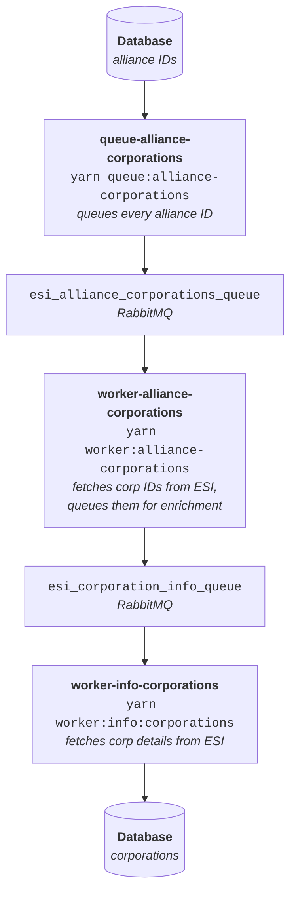

# Alliance Corporation Enrichment Workflow

## Overview

This workflow automatically discovers and adds all corporations belonging to alliances in the database.

## Workflow



## Usage

### Step 1: Queue Alliance IDs

```bash
cd backend
yarn queue:alliance-corporations
```

**What it does:**

- Fetches all alliance IDs from database
- Adds each one to `esi_alliance_corporations_queue`
- Shows progress (batches of 100)

**Example Output:**

```terminal
🤝 Alliance Corporation Queue Script Started
━━━━━━━━━━━━━━━━━━━━━━━━━━━━━━━━━━━━━━━━━━━━━━━━━━━━━━━━━━━━━━━━━━━━
📊 Fetching alliance IDs from database...
✅ Found 142 alliances in database

━━━━━━━━━━━━━━━━━━━━━━━━━━━━━━━━━━━━━━━━━━━━━━━━━━━━━━━━━━━━━━━━━━━━
✅ Connected to RabbitMQ
📦 Queue: esi_alliance_corporations_queue

📤 Adding alliances to queue...

  ✅ Batch 1/2: 100 alliances queued
  ✅ Batch 2/2: 42 alliances queued

━━━━━━━━━━━━━━━━━━━━━━━━━━━━━━━━━━━━━━━━━━━━━━━━━━━━━━━━━━━━━━━━━━━━
✅ Successfully queued 142 alliances!
━━━━━━━━━━━━━━━━━━━━━━━━━━━━━━━━━━━━━━━━━━━━━━━━━━━━━━━━━━━━━━━━━━━━

💡 Next Steps:
   1. Start worker: yarn worker:alliance-corporations
   2. Start enrichment: yarn worker:info:corporations
```

### Step 2: Start Alliance Corporation Worker

**Open a new terminal:**

```bash
cd backend
yarn worker:alliance-corporations
```

**What it does:**

- Consumes alliance IDs from `esi_alliance_corporations_queue`
- Fetches corporation IDs from ESI for each alliance
- Queues each corporation ID to `esi_corporation_info_queue`
- Processes 5 alliances concurrently (PREFETCH_COUNT=5)

**Example Output:**

```terminal
🤝 Alliance Corporation Worker Started
📦 Input Queue: esi_alliance_corporations_queue
📦 Output Queue: esi_corporation_info_queue
⚡ Prefetch: 5 concurrent

✅ Connected to RabbitMQ
⏳ Waiting for alliances...

  ✅ [1] Goonswarm Federation (1354830081) - Queued 127 corporations
  ✅ [2] Pandemic Horde (99003214) - Queued 89 corporations
  ✅ [3] Test Alliance Please Ignore (498125261) - Queued 64 corporations
  ...
```

### Step 3: Start Corporation Info Worker

**Open a new terminal:**

```bash
cd backend
yarn worker:info:corporations
```

**What it does:**

- Consumes corporation IDs from `esi_corporation_info_queue`
- Fetches detailed information from ESI for each corporation
- Saves to database (skips if already exists)
- Processes 5 corporations concurrently (PREFETCH_COUNT=5)

**Example Output:**

```terminal
🏢 Corporation Info Worker Started
📦 Queue: esi_corporation_info_queue
⚡ Prefetch: 5 concurrent

✅ Connected to RabbitMQ
⏳ Waiting for corporations...

  ✅ [1] Added: GoonWaffe (1354830081)
  - [2] Corporation 98234567 (exists)
  ✅ [3] Added: Pandemic Horde Inc. (98435656)
  ...
```

## Technical Details

### ESI Endpoints Used

1. **Alliance Corporations List:**

   ```terminal
   GET https://esi.evetech.net/latest/alliances/{alliance_id}/corporations/
   ```

   - Rate limit: ESI rate limiter (50 req/sec)
   - Response: Array of corporation IDs
   - Public endpoint (no auth required)

2. **Corporation Information:**

   ```terminal
   GET https://esi.evetech.net/latest/corporations/{corporation_id}/
   ```

   - Rate limit: ESI rate limiter (50 req/sec)
   - Response: Corporation details
   - Public endpoint (no auth required)

### Queues

| Queue Name                     | Purpose                                |
| ------------------------------ | -------------------------------------- |
| `esi_alliance_corporations_queue`   | Holds alliance IDs                     |
| `esi_corporation_info_queue` | Holds corporation IDs (for enrichment) |

### Message Format

```typescript
interface EntityQueueMessage {
  entityId: number; // Alliance or Corporation ID
  queuedAt: string; // ISO timestamp
  source: string; // "esi_alliance_corporations_queue" or "alliance_{id}"
}
```

### Concurrency Settings

- **queue-alliance-corporations**: Batch size 100
- **worker-alliance-corporations**: 5 concurrent (PREFETCH_COUNT=5)
- **worker-info-corporations**: 5 concurrent (PREFETCH_COUNT=5)

### Rate Limiting

All ESI calls are made using `esiRateLimiter`:

- Max: 50 requests/second
- Min delay: 20ms between requests
- Automatic retry mechanism

## Monitoring

### Queue Status Check

Via GraphQL:

```graphql
query {
  workerStatus {
    queueName
    messageCount
    consumerCount
  }
}
```

### Log Check

Workers provide detailed log output:

- Processed count
- Corporations queued per alliance
- Errors (with automatic retry)
- Completion summary

### Graceful Shutdown with SIGINT

When you close workers with `Ctrl+C`:

- Total processed statistics are displayed
- Current operations are completed
- Clean shutdown

## Example Usage Scenario

```bash
# Terminal 1: Queue alliance IDs
cd backend
yarn queue:alliance-corporations
# Output: 142 alliances queued

# Terminal 2: Start alliance corporation worker
cd backend
yarn worker:alliance-corporations
# This worker fetches corp IDs from ESI and queues them

# Terminal 3: Start corporation enrichment worker
cd backend
yarn worker:info:corporations
# This worker fetches corporation details and saves to database

# Result: All corporations belonging to alliances are in the database
```

## Error Scenarios

### Alliance Has No Corporations

```terminal
⚠️ [15] Test Alliance (12345) - No corporations found
```

Normal situation, worker continues.

### ESI Error

```terminal
❌ [23] Alliance 456789 - Error: Failed to fetch alliance corporations: 500
```

Message is automatically requeued (nack), worker will retry.

### Database Connection Error

Worker stops, needs to be restarted. RabbitMQ preserves messages.

## Performance

### Expected Processing Time

- **For 142 alliances**:
  - Alliance corporation worker: ~5-10 minutes
  - Corporation enrichment: Depends on corps per alliance
  - Example: ~30-60 minutes for 10,000 corporations

### Parallel Execution

You can run multiple worker instances:

```bash
# Terminal 1
yarn worker:alliance-corporations

# Terminal 2 (simultaneously)
yarn worker:alliance-corporations

# Terminal 3
yarn worker:info:corporations

# Terminal 4
yarn worker:info:corporations
```

**WARNING:** Monitor total PREFETCH count to avoid exceeding ESI rate limits!

## Troubleshooting

### "No alliances found in database"

```bash
# First fetch alliances:
yarn queue:alliances
yarn worker:info:alliances
```

### RabbitMQ Connection Error

```bash
# Check if RabbitMQ is running:
docker ps | grep rabbitmq

# Or start RabbitMQ:
docker start rabbitmq  # or docker-compose up -d
```

### ESI Rate Limit Error

Lower the PREFETCH_COUNT value in workers or run fewer worker instances.

## Future Improvements

1. **Progress Tracking**: Track processed alliances in database
2. **Incremental Updates**: Only fetch new corporations
3. **Batch Corporation Fetch**: Fetch multiple corp IDs at once
4. **Dashboard**: Real-time progress monitoring
5. **Metrics**: Prometheus/Grafana integration
