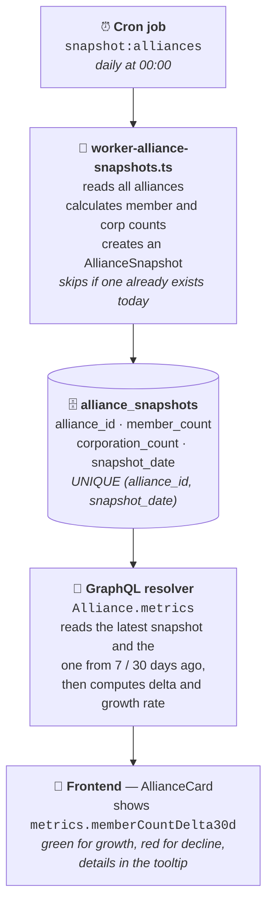

# 📊 Alliance Snapshot & Metrics System

> **Track alliance growth and decline trends over time with automated daily snapshots and delta calculations.**

## ✨ Features

- 📸 **Daily Snapshots**: Automatically captures alliance member count and corporation count every day
- 📈 **Delta Metrics**: Shows changes over 7-day and 30-day periods
- 📊 **Growth Rates**: Calculates percentage-based growth/decline rates
- 🕰️ **Historical Data**: Query snapshot history for any time period
- 🎯 **Unique Guarantee**: One snapshot per alliance per day (enforced by database constraint)
- 🔍 **Audit Trail**: Both `snapshot_date` (business logic) and `created_at` (debugging) timestamps

## 🗄️ Database Schema

### AllianceSnapshot Table

```sql
CREATE TABLE alliance_snapshots (
  id BIGSERIAL PRIMARY KEY,
  alliance_id INTEGER NOT NULL REFERENCES alliances(id) ON DELETE CASCADE,
  member_count INTEGER NOT NULL,
  corporation_count INTEGER NOT NULL,
  snapshot_date DATE NOT NULL,              -- Business logic (YYYY-MM-DD)
  created_at TIMESTAMP NOT NULL DEFAULT NOW(), -- Audit trail (exact time)
  UNIQUE(alliance_id, snapshot_date)        -- One snapshot per alliance per day
);

CREATE INDEX idx_alliance_snapshots_snapshot_date ON alliance_snapshots(snapshot_date);
CREATE INDEX idx_alliance_snapshots_alliance_id ON alliance_snapshots(alliance_id);
```

**Key Design Decisions:**

| Field             | Type                           | Purpose                                                  |
| ----------------- | ------------------------------ | -------------------------------------------------------- |
| `snapshot_date`   | `DATE`                         | Business logic - Used for delta calculations and queries |
| `created_at`      | `TIMESTAMP`                    | Audit trail - Exact time when snapshot was taken         |
| Unique Constraint | `(alliance_id, snapshot_date)` | Prevents duplicate snapshots for same day                |

## 🔌 GraphQL API

### Alliance Type Extensions

```graphql
type Alliance {
  id: Int!
  name: String!
  memberCount: Int! # ⚡ Current total members
  corporationCount: Int! # ⚡ Current total corporations
  metrics: AllianceMetrics # 📊 Delta and growth rate data
  snapshots(days: Int): [AllianceSnapshot!]! # 🕰️ Historical snapshot data
}

type AllianceMetrics {
  memberCountDelta7d: Int # 📈 Member change (7 days)
  memberCountDelta30d: Int # 📈 Member change (30 days)
  corporationCountDelta7d: Int # 🏢 Corporation change (7 days)
  corporationCountDelta30d: Int # 🏢 Corporation change (30 days)
  memberCountGrowthRate7d: Float # 📊 Growth rate % (7 days)
  memberCountGrowthRate30d: Float # 📊 Growth rate % (30 days)
  corporationCountGrowthRate7d: Float # 📊 Corp growth rate % (7 days)
  corporationCountGrowthRate30d: Float # 📊 Corp growth rate % (30 days)
}

type AllianceSnapshot {
  date: String! # 📅 YYYY-MM-DD format
  memberCount: Int! # 👥 Total members on this date
  corporationCount: Int! # 🏢 Total corporations on this date
}
```

### 📝 Query Examples

#### Get Alliance with Metrics

```graphql
query AllianceWithMetrics {
  alliance(id: 99003214) {
    id
    name
    memberCount
    corporationCount
    metrics {
      memberCountDelta7d
      memberCountDelta30d
      memberCountGrowthRate7d
      memberCountGrowthRate30d
    }
  }
}
```

**Response:**

```json
{
  "data": {
    "alliance": {
      "id": 99003214,
      "name": "Goonswarm Federation",
      "memberCount": 30523,
      "corporationCount": 150,
      "metrics": {
        "memberCountDelta7d": 234,
        "memberCountDelta30d": -1250,
        "memberCountGrowthRate7d": 0.77,
        "memberCountGrowthRate30d": -3.93
      }
    }
  }
}
```

#### Get Historical Snapshots

```graphql
query AllianceHistory {
  alliance(id: 99003214) {
    name
    snapshots(days: 30) {
      date
      memberCount
      corporationCount
    }
  }
}
```

**Response:**

```json
{
  "data": {
    "alliance": {
      "name": "Goonswarm Federation",
      "snapshots": [
        { "date": "2025-10-09", "memberCount": 31773, "corporationCount": 152 },
        { "date": "2025-10-10", "memberCount": 31650, "corporationCount": 151 },
        { "date": "2025-11-08", "memberCount": 30523, "corporationCount": 150 }
      ]
    }
  }
}
```

## 🤖 Worker Usage

### Manual Snapshot Creation

Take snapshots for all alliances right now:

```bash
cd backend
yarn snapshot:alliances
```

**Output:**

```
📸 Alliance Snapshot Worker started...
✓ Found 3540 alliances
  ⏳ Processed: 50/3540 (50 new, 0 existing)
  ⏳ Processed: 100/3540 (100 new, 0 existing)
✅ Snapshot creation completed!
   • Total processed: 3540
   • New snapshots: 3540
   • Already existing: 0
   • Duration: 45.23 seconds
   • Date: 2025-11-08
```

### ⏰ Automated Cron Job Setup

Set up a cron job to run snapshots automatically every day:

```bash
# Edit crontab
crontab -e

# Run every day at midnight (00:00)
0 0 * * * cd /root/killreport/backend && yarn snapshot:alliances >> /var/log/alliance-snapshots.log 2>&1
```

### 📅 Cron Schedule Examples

| Schedule          | Cron Expression | Description       |
| ----------------- | --------------- | ----------------- |
| Daily at midnight | `0 0 * * *`     | Most recommended  |
| Daily at 2 AM     | `0 2 * * *`     | Off-peak hours    |
| Daily at 6 AM     | `0 6 * * *`     | Before peak usage |
| Every 12 hours    | `0 */12 * * *`  | Twice daily       |

### 🛡️ Worker Behavior

**First run of the day:**

```bash
yarn snapshot:alliances
# ✅ Creates 3540 new snapshots
```

**Second run same day:**

```bash
yarn snapshot:alliances
# ✅ Skips 3540 existing snapshots (duplicate check)
```

**Next day:**

```bash
yarn snapshot:alliances
# ✅ Creates 3540 new snapshots for the new date
```

## ⚙️ Implementation Details

### Delta Calculation Logic

```typescript
// Get current values
const currentMemberCount = await getTotalMembers(allianceId);

// Find snapshot from 7 days ago (or closest before that)
const snapshot7d = await prisma.allianceSnapshot.findFirst({
  where: {
    alliance_id: allianceId,
    snapshot_date: { lte: date7dAgo },
  },
  orderBy: { snapshot_date: "desc" },
});

// Calculate delta (difference)
const delta7d = currentMemberCount - snapshot7d.member_count;

// Calculate growth rate (percentage)
const growthRate7d = (delta7d / snapshot7d.member_count) * 100;
```

### 🔒 Unique Constraint Protection

The database enforces one snapshot per alliance per day:

```prisma
@@unique([alliance_id, snapshot_date])
```

**What happens on duplicate attempt:**

```typescript
// First run today - SUCCESS ✅
await prisma.allianceSnapshot.create({
  data: {
    alliance_id: 99003214,
    member_count: 30523,
    corporation_count: 150,
    snapshot_date: new Date("2025-11-08"),
  },
});

// Second run today - SKIPPED ⏭️
// Worker checks if snapshot exists before creating
const existing = await prisma.allianceSnapshot.findUnique({
  where: {
    alliance_id_snapshot_date: {
      alliance_id: 99003214,
      snapshot_date: new Date("2025-11-08"),
    },
  },
});
if (existing) {
  console.log("Snapshot already exists, skipping...");
}
```

## 🧪 Testing

### Run Test Script

```bash
cd backend
./test-alliance-metrics.sh
```

**Expected Output:**

```json
{
  "data": {
    "alliances": {
      "edges": [
        {
          "node": {
            "id": 99003214,
            "name": "Goonswarm Federation",
            "metrics": {
              "memberCountDelta30d": -1250,
              "memberCountGrowthRate30d": -3.93
            }
          }
        }
      ]
    }
  }
}
```

### Manual GraphQL Test

```bash
# Start backend server
yarn dev

# In another terminal, test the API
curl -X POST http://localhost:4000/graphql \
  -H "Content-Type: application/json" \
  -d '{
    "query": "query { alliances(filter: { limit: 1 }) { edges { node { id name metrics { memberCountDelta30d memberCountGrowthRate30d } } } } }"
  }'
```

### Test Data Verification

```bash
# Check if snapshots exist in database
cd backend
yarn prisma:studio

# Navigate to alliance_snapshots table
# Verify:
# - ✅ One snapshot per alliance per day
# - ✅ snapshot_date is DATE type (YYYY-MM-DD)
# - ✅ created_at is TIMESTAMP (with time)
```

## 🎨 Frontend Integration

### AllianceCard Component

Displays delta data with color-coded indicators:

```tsx
const memberDelta30d = alliance.metrics?.memberCountDelta30d ?? null;
const memberGrowthRate30d = alliance.metrics?.memberCountGrowthRate30d ?? null;

// Color coding: Green for growth, Red for decline
const deltaColor =
  memberDelta30d && memberDelta30d >= 0 ? "text-green-400" : "text-red-400";

// Display with icon
<div className={deltaColor}>
  <ArrowTrendingUpIcon className="w-5 h-5" />
  <span>
    {memberDelta30d >= 0 ? "+" : ""}
    {memberDelta30d}
  </span>
  {memberGrowthRate30d && (
    <span className="text-xs">({memberGrowthRate30d.toFixed(1)}%)</span>
  )}
</div>;
```

### GraphQL Query

```graphql
query Alliances {
  alliances {
    edges {
      node {
        id
        name
        memberCount
        corporationCount
        metrics {
          memberCountDelta7d
          memberCountDelta30d
          memberCountGrowthRate7d
          memberCountGrowthRate30d
        }
      }
    }
  }
}
```

### UI Display Examples

| Delta | Growth Rate | Display          | Color    |
| ----- | ----------- | ---------------- | -------- |
| +234  | +0.77%      | ↗️ +234 (+0.8%)  | 🟢 Green |
| -1250 | -3.93%      | ↘️ -1250 (-3.9%) | 🔴 Red   |
| 0     | 0.00%       | → 0 (0.0%)       | ⚪ Gray  |
| null  | null        | N/A              | ⚫ Gray  |

## ⚡ Performance Considerations

### N+1 Query Prevention

The metrics field resolver runs separate queries for each alliance, but performance is optimized through:

- **Database Indexes**: Fast lookups on `alliance_id` and `snapshot_date`
- **Optimized Queries**: Uses `findFirst` with `orderBy` for efficient retrieval
- **Future Enhancement**: DataLoader can be added for batch loading

### Database Indexes

```sql
CREATE INDEX idx_alliance_snapshots_alliance_id ON alliance_snapshots(alliance_id);
CREATE INDEX idx_alliance_snapshots_snapshot_date ON alliance_snapshots(snapshot_date);
CREATE UNIQUE INDEX idx_alliance_snapshots_unique ON alliance_snapshots(alliance_id, snapshot_date);
```

**Index Performance:**

- ✅ `alliance_id` index: Fast alliance-specific queries
- ✅ `snapshot_date` index: Fast date range queries
- ✅ Unique index: Prevents duplicates AND speeds up lookups

### Query Optimization Tips

```typescript
// ✅ GOOD: Query specific date ranges
const snapshots = await prisma.allianceSnapshot.findMany({
  where: {
    snapshot_date: {
      gte: new Date("2025-10-01"),
      lte: new Date("2025-11-08"),
    },
  },
});

// ❌ BAD: Don't query all snapshots
const allSnapshots = await prisma.allianceSnapshot.findMany();
```

## 🐛 Troubleshooting

### ❌ Metrics returning null

**Cause:** No snapshot data exists yet.

**Solution:**

```bash
yarn snapshot:alliances
```

**Wait at least 7-30 days for delta calculations to work properly.**

---

### ❌ Duplicate key error on snapshot

**Cause:** Snapshot already exists for this alliance today.

**Solution:** This is expected behavior! The worker automatically skips existing snapshots. No action needed.

```
✅ Expected: Worker skips and continues processing other alliances
❌ Don't: Manually try to fix or delete snapshots
```

---

### ❌ No historical data available

**Cause:** Newly set up system, no historical snapshots yet.

**Solution Option 1 - Wait naturally:**

```bash
# Just wait - snapshots accumulate over time
# Day 1: No deltas (need 7+ days)
# Day 7: 7-day deltas available
# Day 30: 30-day deltas available
```

**Solution Option 2 - Backfill manually:**

```sql
-- Backfill snapshot for 7 days ago (example)
INSERT INTO alliance_snapshots (alliance_id, member_count, corporation_count, snapshot_date, created_at)
SELECT
  id,
  (SELECT SUM(member_count) FROM corporations WHERE alliance_id = alliances.id),
  (SELECT COUNT(*) FROM corporations WHERE alliance_id = alliances.id),
  CURRENT_DATE - INTERVAL '7 days',
  NOW()
FROM alliances;
```

⚠️ **Warning:** Backfilling gives approximate historical data, not actual past values.

---

### ❌ Worker takes too long

**Cause:** Processing 3540+ alliances can take 30-60 seconds.

**Solution:** This is normal! Consider:

- Running during off-peak hours (cron at 2-6 AM)
- Monitoring with logs: `yarn snapshot:alliances >> /var/log/snapshots.log`
- Future: Batch processing or parallel workers

---

### ❌ Metrics calculation wrong

**Cause:** Check if current values are being calculated correctly.

**Debug:**

```typescript
// Check current member count
const current = await prisma.corporation.aggregate({
  where: { alliance_id: 99003214 },
  _sum: { member_count: true },
});
console.log("Current:", current._sum.member_count);

// Check 7-day snapshot
const snapshot = await prisma.allianceSnapshot.findFirst({
  where: {
    alliance_id: 99003214,
    snapshot_date: { lte: date7dAgo },
  },
  orderBy: { snapshot_date: "desc" },
});
console.log("7 days ago:", snapshot?.member_count);
```

## 🚀 Future Improvements

### Planned Enhancements

| Feature                       | Description                                          | Priority |
| ----------------------------- | ---------------------------------------------------- | -------- |
| 🔄 **DataLoader Integration** | Batch snapshot queries to prevent N+1 problems       | High     |
| 📊 **Additional Metrics**     | Killmail count, activity score, ISK destroyed deltas | Medium   |
| 🗑️ **Snapshot Retention**     | Auto-delete snapshots older than 1 year              | Low      |
| 📈 **Aggregated Views**       | Pre-calculated monthly/yearly averages               | Medium   |
| 🔔 **Alerting System**        | Notifications for significant changes (>10% change)  | Low      |
| 📉 **Trend Charts**           | Frontend visualization of growth trends              | High     |
| 🏢 **Corporation Snapshots**  | Same system for individual corporations              | Medium   |
| 🎯 **Killmail Metrics**       | Track PVP activity changes                           | Medium   |

### Example: Killmail Metrics

```graphql
type AllianceMetrics {
  # Existing fields...
  killmailCountDelta7d: Int
  killmailCountDelta30d: Int
  iskDestroyedDelta7d: Float
  iskDestroyedDelta30d: Float
}
```

## 🏗️ Architecture Overview



### Data Flow

```typescript
// 1️⃣ Daily Worker (Automated)
Cron → Worker → Calculate Current Values → Save Snapshot

// 2️⃣ GraphQL Query (On Demand)
Frontend → GraphQL → Resolver → Fetch Snapshots → Calculate Delta → Response

// 3️⃣ Display (Real-time)
Response → React Component → Color-coded Delta → User sees trend
```

## 📚 Related Files

| File                                               | Purpose                            |
| -------------------------------------------------- | ---------------------------------- |
| `backend/prisma/schema.prisma`                     | AllianceSnapshot model definition  |
| `backend/src/schema/alliance.graphql`              | GraphQL type definitions           |
| `backend/src/resolvers/alliance.resolver.ts`       | Metrics calculation logic          |
| `backend/src/workers/worker-alliance-snapshots.ts` | Daily snapshot worker              |
| `backend/package.json`                             | NPM scripts (`snapshot:alliances`) |
| `frontend/src/components/Card/AllianceCard.tsx`    | UI component                       |
| `frontend/src/app/alliances/alliances.graphql`     | Frontend GraphQL query             |
| `backend/test-alliance-metrics.sh`                 | Testing script                     |

---

## 📖 Quick Reference

### Commands

```bash
# Take snapshot manually
yarn snapshot:alliances

# Test metrics API
./test-alliance-metrics.sh

# View database
yarn prisma:studio

# Check migration status
npx prisma migrate status
```

### Key Concepts

- **Snapshot**: Daily record of alliance state (member count, corp count)
- **Delta**: Change between current and historical values (e.g., -1250 members)
- **Growth Rate**: Percentage change (e.g., -3.93%)
- **snapshot_date**: Business logic field (DATE type)
- **created_at**: Audit trail field (TIMESTAMP type)

---

Made with ❤️ for EVE Online alliance tracking
