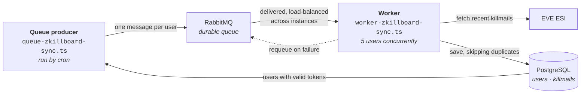

# Killmail Background Worker

Automated background service that syncs killmails from Eve Online ESI API to the database using RabbitMQ for scalability and reliability.

## Features

- 🔄 **RabbitMQ Queue**: Distributed job processing with retry mechanism
- 👥 **Multi-Worker Support**: Scale horizontally by running multiple workers
- 🔐 **Token Management**: Checks token expiry before each sync
- 💾 **Smart Deduplication**: Skips killmails that already exist in database
- 📊 **Detailed Logging**: Real-time progress and statistics
- ⚡ **Prefetch Control**: Configurable concurrent job processing
- 🛡️ **Error Resilience**: Failed jobs are automatically requeued
- 🎯 **Priority Queue**: Support for prioritizing urgent sync jobs

## Architecture



## How It Works

### 1. Queue Producer (`queue-zkillboard-sync.ts`)

Finds all users with valid tokens and adds them to the queue:

```bash
yarn queue:zkillboard
```

This will:

- Query database for active users (non-expired tokens)
- Add each user as a message to RabbitMQ queue
- Messages persist even if RabbitMQ restarts

### 2. Worker Consumer (`worker-zkillboard-sync.ts`)

Processes messages from the queue:

```bash
yarn worker:zkillboard
```

This will:

- Connect to RabbitMQ queue
- Process 5 users concurrently (configurable)
- For each user:
  - Call ESI `/characters/{id}/killmails/recent/`
  - Get killmail details for each new killmail
  - Save to database with full attacker information

4. **Deduplication**: Skip killmails that already exist
5. **Statistics**: Log saved and skipped counts

- Acknowledge successful jobs
- Requeue failed jobs for retry

### 3. Database Schema

```typescript
model Killmail {
  id                     BigInt   @id @default(autoincrement())
  killmailId             Int      @unique  // Eve Online killmail ID
  killmailHash           String
  killmail_time          DateTime
  solar_system_id        Int
  victim_character_id    Int?
  victim_corporation_id  Int
  victim_ship_type_id    Int
  victim_damage_taken    Int
  // ... position data

  attackers Attacker[]  // One-to-many relation
}

model Attacker {
  killmail_id     BigInt
  character_id    Int?
  corporation_id  Int?
  damage_done     Int
  final_blow      Boolean
  // ...
}
```

## Running the Worker

### Step 1: Start RabbitMQ

Make sure RabbitMQ is installed and running on your system:

```bash
# Check if RabbitMQ is running
sudo systemctl status rabbitmq-server

# Start RabbitMQ if not running
sudo systemctl start rabbitmq-server

# Enable RabbitMQ management plugin for web UI
sudo rabbitmq-plugins enable rabbitmq_management
```

Access the management UI at http://localhost:15672 (default credentials: guest/guest)

### Step 2: Queue Users

```bash
cd backend
yarn queue:zkillboard
```

Output:

```
📡 Queueing users for killmail sync...

✓ Found 42 active users
📤 Adding to queue...

✅ All 42 users queued successfully!
💡 Now run the worker to process them: yarn worker:zkillboard
```

### Step 3: Start Worker(s)

```bash
# Single worker
yarn worker:zkillboard

# Multiple workers (for scaling)
yarn worker:zkillboard &
yarn worker:zkillboard &
yarn worker:zkillboard &
```

### Production Mode

```bash
# Using PM2 (recommended)
pm2 start dist/queue-zkillboard-sync.js --name "zkill-queue" --cron "*/5 * * * *"
pm2 start dist/worker-zkillboard-sync.js --name "zkill-worker" -i 3

# Or with Node.js + cron
# Add to crontab: */5 * * * * cd /app && yarn queue:zkillboard
node dist/killmail-worker.js
```

## Configuration

Edit constants in respective files:

**`src/workers/queue-zkillboard-sync.ts`:**

```typescript
const QUEUE_NAME = "zkillboard_character_queue";
```

**`src/workers/worker-zkillboard-sync.ts`:**

```typescript
const QUEUE_NAME = "zkillboard_character_queue";
const PREFETCH_COUNT = 1; // Concurrent users per worker
const MAX_PAGES = 100; // Max pages to fetch from zKillboard
```

### Recommended Settings

- **Development**:

  - `PREFETCH_COUNT`: 3-5 users
  - Queue manually or every 10 minutes

- **Production**:
  - `PREFETCH_COUNT`: 5-10 users (depends on ESI rate limits)
  - Queue every 5 minutes via cron
  - Run 2-3 workers for redundancy## Console Output Example

### Queue Producer

```
� Queueing users for killmail sync...

✓ Found 42 active users
📤 Adding to queue...

✅ All 42 users queued successfully!
💡 Now run the worker to process them: yarn worker:zkillboard
```

### Worker Consumer

```
🔄 Killmail Worker Started
📦 Queue: zkillboard_character_queue
⚡ Prefetch: 1 concurrent users

✅ Connected to RabbitMQ
⏳ Waiting for killmail sync jobs...

━━━━━━━━━━━━━━━━━━━━━━━━━━━━━━━━━━━━━━━━━━━━━━━━━━━━━━━━━━━━
� Processing: General XAN (ID: 365974960)
📅 Queued at: 2025-10-29T10:00:00.000Z
━━━━━━━━━━━━━━━━━━━━━━━━━━━━━━━━━━━━━━━━━━━━━━━━━━━━━━━━━━━━
  📥 Found 15 killmails
  ✅ Saved: 12, Skipped: 3
✅ Completed: General XAN
```

## Error Handling

### Token Expiry

If a user's token has expired, the worker will:

- Log a warning
- Skip that user
- Continue with other users

**Future Enhancement**: Implement automatic token refresh using `refreshToken`

### ESI API Errors

- **403 Forbidden**: User lacks permissions (e.g., corporation killmails without roles)
- **404 Not Found**: Character or killmail doesn't exist
- **Rate Limiting**: ESI returns 420 - worker should implement exponential backoff

### Database Errors

If a killmail fails to save:

- Error is logged with killmail ID
- Worker continues with next killmail
- No data loss for other killmails

## Integration with GraphQL

The worker runs independently but works with the GraphQL API:

```graphql
# Manual sync trigger (if needed)
mutation {
  syncMyKillmails {
    success
    message
    syncedCount
  }
}

# View synced killmails
query {
  myKillmails(limit: 20) {
    killmailId
    killmailTime
    victim {
      characterId
      shipTypeId
    }
  }
}
```

## Monitoring

### Key Metrics to Track

- **Sync Duration**: How long each cycle takes
- **Success Rate**: Percentage of successful syncs
- **Database Growth**: Number of killmails per hour
- **Error Rate**: Failed API calls or database writes

### Health Check Endpoint (TODO)

Add a health check to your GraphQL server:

```graphql
type Query {
  workerStatus: WorkerStatus!
}

type WorkerStatus {
  isRunning: Boolean!
  lastSync: String!
  totalUsers: Int!
  lastSyncDuration: Int!
}
```

## Deployment Considerations

### Production Setup

For production deployment, consider:

1. **Process Manager**: Use PM2 or similar to keep workers running

   ```bash
   npm install -g pm2
   pm2 start dist/killmail-worker.js --name killmail-worker
   pm2 startup
   pm2 save
   ```

2. **Multiple Workers**: Run multiple worker instances for better throughput

   ```bash
   pm2 start dist/killmail-worker.js -i 3 --name killmail-worker
   ```

3. **Monitoring**: Set up logging and monitoring for worker health

### Kubernetes

```yaml
apiVersion: apps/v1
kind: Deployment
metadata:
  name: killmail-worker
spec:
  replicas: 1 # Only run ONE instance
  template:
    spec:
      containers:
        - name: worker
          image: killreport-backend:latest
          command: ["node", "dist/killmail-worker.js"]
```

⚠️ **Important**: Only run ONE instance of the worker to avoid duplicate processing!

## Future Enhancements

- [ ] Automatic token refresh using refresh tokens
- [ ] Configurable sync intervals per user (premium users = faster sync)
- [ ] Corporation killmail syncing (requires director role)
- [ ] Prometheus metrics export
- [ ] Dead letter queue for failed killmails
- [ ] Priority queue (recent kills processed first)
- [ ] Rate limit handling with exponential backoff

## Troubleshooting

### Worker Not Starting

```bash
# Check if port is already in use
lsof -ti:4000 | xargs kill -9

# Check database connection
yarn prisma studio
```

### No Users Being Synced

```bash
# Verify users exist with valid tokens
yarn prisma studio
# Check User table - ensure expiresAt > now()
```

### High Memory Usage

- Reduce `BATCH_SIZE`
- Increase `SYNC_INTERVAL`
- Add memory limits in production

## License

MIT
