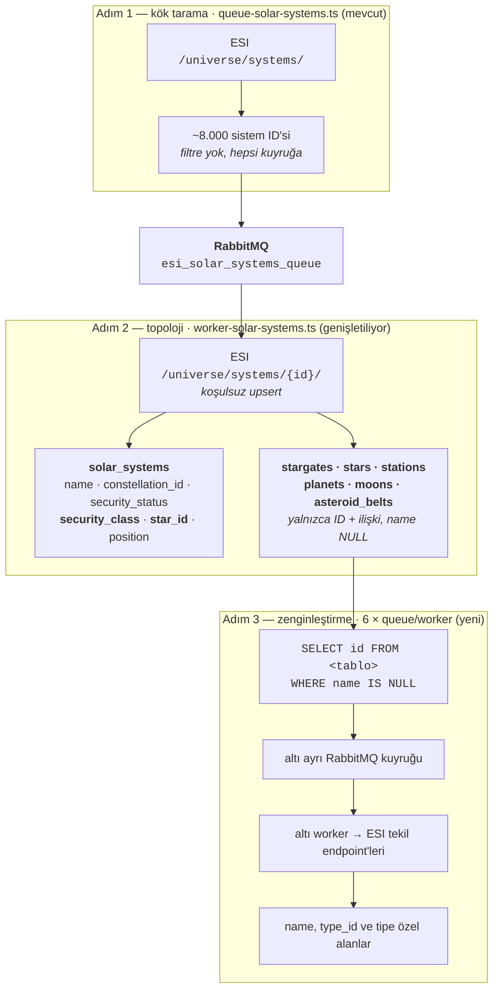

# Solar System Detay Sayfası İyileştirmeleri — Tasarım

Tarih: 2026-08-27
Durum: Taslak — inceleme bekliyor
Kapsam: `frontend/src/app/solar-systems/[id]/page.tsx`, onu besleyen GraphQL katmanı
ve evren topolojisi için yeni bir ESI ingest hattı

## 1. Bağlam

Solar system detay sayfası uzamsal hiyerarşinin (Region → Constellation → Solar
System) en derin düğümü ve sitedeki en çok link alan sayfalardan biri. Bugün iki
sekmesi var: `Attributes` (system ID, security status, star ID, konum hiyerarşisi
ve ham x/y/z koordinatları) ve `Killmails` (sayfalanmış tablo + dört kartlık
"son 7 gün" sidebar'ı). Sayfanın tamamı tek bir 572 satırlık client component.

Kullanıcı dört sekmeyi zorunlu olarak istedi: **Adjacent Solar Systems**,
**Orbital Bodies** (gezegenler altında aylar ve asteroid belt'ler katlanabilir
şekilde), **Structures** ve **Sovereignty**. Bu dördünün üçü veritabanında
bulunmayan veriye dayanıyor, dolayısıyla bu tasarım bir sayfa iyileştirmesi
değil, aynı zamanda yeni bir evren topolojisi ingest'i.

## 2. Bugün elde ne var, ne yok

**Var:**

- `SolarSystem` modeli: id, name, constellation_id, security_status,
  security_class, star_id, position x/y/z. Başka hiçbir şey yok
  (`backend/prisma/schema/solarSystem.prisma`). Dahası, `security_class` ve
  `star_id` kolonları şemada duruyor ama worker'ın upsert'i onları hiç yazmıyor
  (`backend/src/workers/worker-solar-systems.ts:41-58`) — ikisi de bugün boş.
- Sovereignty: `sovereigntyStructures(systemId:)` sahip alliance'ı, ADM
  karşılığını (`occupancyLevel`) ve vulnerability penceresini döndürüyor;
  `sovereigntyActiveCampaigns` aktif kampanyaları veriyor
  (`backend/src/schemas/Sovereignty.graphql`). Sistem sayfası ikisine de
  dokunmuyor.
- `systemKillsHistory(filter: { system_id, hours })` saatlik ship / pod / NPC
  kill snapshot'ları döndürüyor (`backend/src/resolvers/system-kills/queries.ts:9`).
  Frontend bunun sadece en son satırını `latestKills` üzerinden okuyor.
- `Type` verisi ingest ediliyor, yani type_id → isim çözümü mevcut.

**Yok:** stargate, star, planet, moon, asteroid belt, station için hiçbir
Prisma modeli, worker, resolver ya da GraphQL tipi. Repo genelinde tek bir
referans bile yok.

**Kritik bulgu:** `backend/src/workers/worker-solar-systems.ts:29` zaten
`/universe/systems/{id}/` endpoint'ini çağırıyor. Bu endpoint yanıtında
`stargates[]`, `stations[]`, `planets[]` (her gezegen altında `moons[]` ve
`asteroid_belts[]` ID dizileriyle) ve `star_id` dönüyor. Worker bunların hepsini
atıyor, yalnızca name / constellation_id / security_status / position kaydediyor.

Yani **topolojinin tamamı — hangi sistemde hangi stargate, hangi gezegen, o
gezegenin hangi ayları ve belt'leri, hangi istasyonlar, hangi yıldız — zaten
yapılan çağrının içinden, ek bir ESI maliyeti olmadan çıkarılabilir.** Ek çağrı
gereken tek şey bu ID'lerin isimleri ve tipleri.

Yanıtın şekli canlı ESI'dan üç sistemle doğrulandı (4-HWWF 30000240, Jita
30000142, Thera 31000005); alanların opsiyonelliği ve buradan çıkan okuma
kuralı §7.3'te.

## 3. Problemler

**P1 — Zorunlu dört sekmenin üçü için veri yok.** Adjacent Solar Systems,
Orbital Bodies ve Structures sekmeleri, ingest edilmemiş veri olmadan
render edilemez.

**P2 — Varsayılan sekme en boş olanı.** `Attributes` sekmesinde işe yarar
neredeyse hiçbir şey yok: `System ID` ve `Star ID` ham ESI tanımlayıcıları,
koordinatlar `-1.2345e+17` metre olarak basılıyor, Location Hierarchy kartı ise
breadcrumb'da ve header'da zaten var olan linkleri tekrarlıyor.

**P3 — Backend'de hazır olan veri gösterilmiyor.** `systemKillsHistory` ve
`sovereigntyStructures` sunucu tarafında tamamen implement edilmiş, frontend
tarafından hiç sorgulanmıyor.

**P4 — Sistem düzeyinde toplu istatistik yok.** Toplam kill, yok edilen ISK, son
24 saatteki hareket, en yoğun saat — hiçbiri yok.

**P5 — URL senkronizasyon effect'i her render'da yazıyor.**
`frontend/src/app/solar-systems/[id]/page.tsx:128-137`'daki effect,
referans kararlılığı garanti olmayan `router`'a bağımlı ve `router.push`'u mount
anında da koşulsuz çağırıyor; kullanıcı hiçbir şeye dokunmadan gereksiz bir
history kaydı ekleniyor. Aynı kalıp killmails sayfasından yeni geri alındı.

**P6 — Sekme değişimi sayfalamayı sıfırlamıyor.** Killmails'in 7. sayfasından
başka sekmeye geçip dönünce `page=7` state'te ve URL'de kalıyor.

**P7 — Dört kartlık "top entities" sidebar'ı dört sayfada kopyalanmış**
(`solar-systems/[id]`, `killmails`, `alliances/[id]`, `corporations/[id]`),
mapping mantığı her seferinde tekrar yazılmış.

**P8 — Detay sorgusu yanlış dosyada.** `SolarSystem($id:)` sorgusu
`SolarSystems.graphql` içinde; repodaki diğer tüm varlıklar detay ve liste
sorgularını ayırmış.

## 4. Hedefler

1. İstenen dört sekmeyi gerçek veriyle çalışır hale getirmek.
2. Bunun için gereken evren topolojisini, ESI maliyetini minimumda tutan bir
   ingest hattıyla veritabanına almak.
3. Açılış sekmesini okumaya değer hale getirmek.
4. P5–P8'i bu işin parçası olarak düzeltmek, sonraya bırakmamak.

## Hedef olmayanlar

- **Upwell yapıları (Astrahus, Fortizar, Athanor, Tatara, Keepstar vb.) kapsam
  dışı.** Public ESI bunları sistem bazında vermiyor; yalnızca corp director
  scope'lu `/corporations/{id}/structures/` ile ya da killmail'lerden çıkarımla
  elde edilebilir. Kullanıcı bunu bilerek kapsam dışı bıraktı.
- Jump rotası hesaplama / rota bulma. Adjacency saklanıyor ama üzerinde graf
  araması yapılmıyor.
- Market verisi, endüstri indeksleri, sistem maliyet indeksleri.
- `KillmailsTable`, `Paginator` ve `Top*Card` bileşenlerinin kendilerinde
  yeniden tasarım.

## 5. Varsayımlar

Bunlar bir gereksinim görüşmesi olmadan alınmış kararlar; her biri itiraz
edilebilir.

- **V1 — Structures sekmesi NPC istasyonlarını gösteriyor.** Upwell kapsam dışı
  olduğuna göre geriye public ESI'da bulunan `stations[]` kalıyor. Sovereignty
  yapıları (TCU/IHub) burada tekrarlanmıyor; kendi sekmelerinde duruyorlar.
- **V2 — Her gök cismi ESI'dan otoriter olarak çekiliyor.** Ay ve asteroid belt
  isimleri kalıptan türetilmiyor. Bunlar sabit veri; tek seferlik çağrı sayısı
  repo için bir engel değil (alliance ve type ingest'leri zaten aynı büyüklükte)
  ve türetilen isim shattered sistemlerde ya da özel isimli cisimlerde sessizce
  yanlış olabilir. Ingest, repodaki mevcut `queue-*` / `worker-*` çiftleri
  kalıbıyla yazılıyor.
- **V3 — Gezegenler için `type_id` de saklanıyor.** `/universe/planets/{id}/`
  isim yanında `type_id` veriyor (Barren, Gas, Temperate, Storm…); listede
  gösterilecek değerli bir bilgi.
- **V4 — Overview sekmesi kalıyor.** Zorunlu dört sekmeye ek olarak bir Overview
  ve mevcut Killmails sekmesi duruyor; toplam altı sekme. Overview'de yıldız
  kartı, kill aktivite grafiği ve katlanmış "Technical details" var. İstatistik
  şeridi Overview'ün içinde değil, sekme çubuğunun **üstünde** ve her sekmede
  görünür (§7.1) — sistem düzeyinde bir özet, sekmeye bağlı bir içerik değil.
- **V5 — Ham tanımlayıcılar silinmiyor, katlanıyor.** `System ID`, `Star ID` ve
  koordinatlar Overview altındaki `<details>` bloğuna taşınıyor; koordinatlar
  ayrıca AU'ya çevriliyor. Geliştiriciler ve API kullanıcıları için değerliler.
- **V6 — "En yoğun saat" son 7 gün üzerinden ve UTC.** EVE timer'ları ve
  uygulamanın geri kalanı zaten UTC tabanlı.
- **V7 — Değeri backfill edilmemiş killmail'ler ISK toplamında 0 sayılıyor**,
  hariç tutulmuyor — `KillmailOrderBy.ValueDesc`'in zaten davrandığı gibi.
- **V8 — Yıldız da ingest ediliyor.** `/universe/stars/{id}/` isim, `type_id`,
  spectral class, sıcaklık, yarıçap, yaş ve parlaklık döndürüyor
  (`"4-HWWF - Star"`, `M2 V`, 2971 K). ~8 bin yıldız ≈ 13 dakika, yani altıncı
  bir `queue-*` / `worker-*` çifti pratikte bedava; karşılığında `Star ID` ham
  bir sayı olmaktan çıkıp Overview'de gösterilebilir içeriğe dönüşüyor.

## 6. Değerlendirilen yaklaşımlar

Asıl karar sekmelerin *ne* olacağı değil (kullanıcı söyledi), topolojinin
**nasıl** ingest edileceği.

**A — Topoloji bedava + tam ESI ingest (seçilen).** Adım 2'de
`worker-solar-systems` genişletilir: zaten alınan `/universe/systems/{id}/`
yanıtından yıldız, stargate, gezegen, ay, belt ve istasyon ID'leri ile
aralarındaki ilişkiler kaydedilir — ek ESI maliyeti sıfır. Adım 3'te her nesne tipi için
repodaki `queue-*` / `worker-*` kalıbında bir çift yazılır ve isimler ile
tipler otoriter olarak ESI'dan çekilir. Yıldızlar, aylar ve belt'ler dahil,
istisnasız.

**B — İsim türetimi.** Ay ve belt isimlerini `<Gezegen Adı> - Moon <n>`
kalıbından üretmek çağrı sayısını sıfıra indirirdi, ama shattered sistemlerde ve
özel isimli cisimlerde sessizce yanlış isim üretme riski taşıyor ve doğruluğu
ancak yine ESI'ya sorarak ölçülebiliyor. Kullanıcı bu takası reddetti: veri
sabit, çağrı sayısı sorun değil.

**C — SDE ithalatı.** EVE Static Data Export'u içe aktarmak tüm bu veriyi tek
seferde verir, ama repoda SDE hattı yok; yeni bir indirme, ayrıştırma ve sürüm
takibi mekanizması gerekir ve mevcut mimari tamamen ESI + RabbitMQ üzerine
kurulu.

**Seçilen: A.** Mevcut ingest mimarisiyle birebir aynı kalıp, otoriter veri,
tahmin yok. Adım 2 topolojiyi bedavaya aldığı için Adım 3'ün kuyrukları
ESI'nın liste endpoint'lerine değil doğrudan veritabanına dayanabiliyor — ki
zaten altı gök cismi tipinin **hiçbirinin** liste endpoint'i yok (§7.3).

## 7. Tasarım

### 7.1 Sayfa yapısı

```
Breadcrumb (değişmiyor)
Header
  ├─ security tonlu ikon, sistem adı, SecurityBadge
  ├─ constellation / region linkleri
  ├─ sovereignty sahibi çipi              ← yeni, yalnızca sov tutulan sistemlerde
  └─ latestKills özeti (değişmiyor)
İstatistik şeridi                         ← yeni: 4 kutu, sekmelerin üstünde hep görünür
Sekmeler: [ Overview | Adjacent | Orbital Bodies | Structures | Sovereignty | Killmails ]
  Overview          → yıldız kartı + aktivite grafiği + katlanmış technical details
  Adjacent          → komşu sistemler tablosu
  Orbital Bodies    → gezegen listesi, her gezegen katlanabilir (aylar + belt'ler)
  Structures        → NPC istasyonları
  Sovereignty       → sahip, ADM, timer, aktif kampanya
  Killmails         → mevcut tablo + Paginator + TopEntitySidebar
```

Sekme sayısı altıya çıktığı için sekme çubuğu dar ekranlarda yatay kaydırılabilir
olmalı (`overflow-x-auto`); mevcut `flex gap-4` bu genişlikte taşar.

Sekme etiketleri sayı taşıyor — `Adjacent (7)`, `Orbital Bodies (12)`,
`Structures (3)` — `Region` detay sayfasındaki `Constellations (n)` kalıbıyla
aynı. Sayılar detay sorgusundan `counts` olarak geliyor, sekme açılmasını
beklemeden. Adjacent etiketi `counts.stargates`'i kullanıyor — bu sayı Adım
2'den sonra doğru, sekmenin içeriği ise hedefler çözülene kadar (Adım 3) boş
kalabiliyor (§11 R3).

### 7.2 Veri modeli

Altı yeni Prisma modeli, `backend/prisma/schema/` altında ayrı dosyalarda
(repodaki mevcut düzen: model başına bir dosya).

```prisma
model Stargate {
  id                      Int         @id @map("stargate_id")
  name                    String?
  solar_system_id         Int
  /// Adım 2 bunu boş bırakıyor; yalnızca `worker-stargates` dolduruyor.
  destination_system_id   Int?
  destination_stargate_id Int?
  type_id                 Int?
  position_x              Float?
  position_y              Float?
  position_z              Float?

  solar_system            SolarSystem @relation(fields: [solar_system_id], references: [id], onDelete: Cascade)

  @@index([solar_system_id])
  @@index([destination_system_id])
  @@map("stargates")
}

model Star {
  id              Int         @id @map("star_id")
  name            String?
  solar_system_id Int         @unique
  type_id         Int?
  spectral_class  String?
  temperature     Int?
  radius          Float?
  /// Yıl cinsinden; 4.8e9 gibi değerler Int sınırını aştığı için Float.
  age             Float?
  luminosity      Float?

  solar_system    SolarSystem @relation(fields: [solar_system_id], references: [id], onDelete: Cascade)

  @@map("stars")
}

model Planet {
  id              Int            @id @map("planet_id")
  name            String?
  solar_system_id Int
  type_id         Int?
  /// ESI'nın planets[] dizisindeki 1 tabanlı sırası; isimler gelmeden de
  /// gezegenleri yörünge sırasına dizebilmek için.
  orbit_index     Int?
  position_x      Float?
  position_y      Float?
  position_z      Float?

  solar_system    SolarSystem    @relation(fields: [solar_system_id], references: [id], onDelete: Cascade)
  moons           Moon[]
  asteroid_belts  AsteroidBelt[]

  @@index([solar_system_id])
  @@map("planets")
}

model Moon {
  id              Int         @id @map("moon_id")
  name            String?
  solar_system_id Int
  /// Zorunlu: ESI'da her ay bir gezegenin altında duruyor ve bu bağ yalnızca
  /// Adım 2'de yakalanabiliyor (bkz. §7.3).
  planet_id       Int
  /// ESI'nın planets[].moons dizisindeki 1 tabanlı sırası; listede sıralama için.
  orbit_index     Int?
  position_x      Float?
  position_y      Float?
  position_z      Float?

  solar_system    SolarSystem @relation(fields: [solar_system_id], references: [id], onDelete: Cascade)
  planet          Planet      @relation(fields: [planet_id], references: [id], onDelete: Cascade)

  @@index([solar_system_id])
  @@index([planet_id])
  @@map("moons")
}

model AsteroidBelt {
  id              Int         @id @map("asteroid_belt_id")
  name            String?
  solar_system_id Int
  /// Zorunlu; Moon.planet_id ile aynı gerekçe.
  planet_id       Int
  orbit_index     Int?
  position_x      Float?
  position_y      Float?
  position_z      Float?

  solar_system    SolarSystem @relation(fields: [solar_system_id], references: [id], onDelete: Cascade)
  planet          Planet      @relation(fields: [planet_id], references: [id], onDelete: Cascade)

  @@index([solar_system_id])
  @@index([planet_id])
  @@map("asteroid_belts")
}

model Station {
  id                         Int         @id @map("station_id")
  name                       String?
  solar_system_id            Int
  type_id                    Int?
  owner_corporation_id       Int?
  race_id                    Int?
  reprocessing_efficiency    Float?
  /// İstasyonun yeniden işlemeden aldığı pay (0.05 = %5).
  reprocessing_stations_take Float?
  /// ISK cinsinden ofis kirası.
  office_rental_cost         Float?
  max_dockable_ship_volume   Float?
  services                   String[]
  position_x                 Float?
  position_y                 Float?
  position_z                 Float?

  solar_system               SolarSystem @relation(fields: [solar_system_id], references: [id], onDelete: Cascade)

  @@index([solar_system_id])
  @@map("stations")
}

```

`SolarSystem` modeline karşılık gelen altı ters ilişki alanı ekleniyor;
`star` bunlardan tekil olanı (`Star?`), diğer beşi liste. Hiçbiri ilişki adı
taşımıyor.

`Star.solar_system_id` üzerindeki `@unique`, `SolarSystem.star_id` ile birlikte
aynı ilişkiyi iki uçtan tutuyor. `star_id` kolonu zaten şemada olduğu ve ham
tanımlayıcı olarak §7.5'te gösterildiği için kaldırılmıyor.

`name` alanlarının hepsi nullable ve bu bilinçli: Adım 2 ID'leri isimsiz
yazıyor, Adım 3 dolduruyor. Sayfa isimsiz kaydı ID'siyle gösterebildiği için
ingest tamamlanmadan da çalışıyor. Aynı nullable alan, Adım 3'ün kuyruk
scriptlerine `WHERE name IS NULL` ile doğal bir "kalan iş" sorgusu veriyor.

### 7.3 Ingest hattı

Bu proje ESI'dan veri çekerken iki farklı kuyruk türü kullanıyor; ayrım bugüne
kadar isimlendirilmemişti. Alliance hattı ikisini de barındırıyor:

- **Kök tarama kuyruğu** (`queue-alliances.ts`) — ESI'nın liste endpoint'inden
  (`/alliances/`) tüm ID'leri alır ve **istisnasız hepsini** kuyruğa atar.
  Filtre yok, "zaten var mı" diye bakmaz.
- **Zenginleştirme kuyruğu** (`queue-alliance-corporation-characters.ts`) —
  ID'leri **veritabanından** okur (alliance satırındaki `creator_id`, corp
  satırındaki `ceo_id` / `creator_id`), DB'de zaten olanları eler, yalnızca
  eksikleri kuyruğa atar.

Kritik nokta: **"zaten var mı" filtresi kök tarayıcıda değil, zenginleştirme
kuyruğunda duruyor.** Evren topolojisi hattı aynı ayrımı bir kat aşağıda
tekrarlıyor. Çocuk ID'ler — `stargates[]`, `stations[]`, `planets[]` ve gezegen
altındaki `moons[]` / `asteroid_belts[]` — ebeveynin ESI yanıtının içinden
geliyor, tıpkı `creator_id` / `ceo_id`'nin alliance ve corp satırlarının
içinden gelmesi gibi. Yeni bir keşif mekanizması gerekmiyor; mevcut kalıp bir
kat aşağı uygulanıyor.



**Adım 1 — kök tarama. Yazılacak kod yok.** `queue-solar-systems.ts` bugün
zaten `SolarSystemService.getAllSystemIds()` ile ESI `/universe/systems/`
listesini çekip ~8 bin ID'yi `esi_solar_systems_queue`'ya atıyor
(`backend/src/queues/queue-solar-systems.ts:17`,
`backend/src/services/solar-system/solar-system.service.ts:14`).
`queue-alliances` ile birebir aynı kalıp. Dokunulmuyor.

**Adım 2 — topoloji yazımı. Ek ESI maliyeti yok.**
`backend/src/workers/worker-solar-systems.ts` genişletiliyor. Zaten elde olan
`/universe/systems/{id}/` yanıtından, tek bir Prisma transaction'ı içinde:

- `data.security_class` ve `data.star_id` → `solar_systems` satırında bugün boş
  duran iki kolon
- `data.stargates[]` → `Stargate` satırları (`destination_system_id` henüz boş)
- `data.stations[]` → `Station` satırları
- `data.planets[]` → `Planet` satırları; her gezegenin `moons[]` ve
  `asteroid_belts[]` dizileri `Moon` / `AsteroidBelt` satırlarına. Dizi sırası
  her üç tabloda da `orbit_index` olarak yazılıyor — isimler gelmeden de
  yörünge sırası korunsun diye
- `data.star_id` → `Star` satırı (isimsiz)

**Ebeveyn bağı yalnızca burada yakalanabiliyor — Adım 2'nin asıl sorumluluğu
bu.** Bir ayın ya da asteroid belt'in hangi gezegene ait olduğu bilgisi *sadece*
bu yanıtın iç içeliğinde duruyor. Tekil endpoint'lerin hiçbiri vermiyor (canlı
olarak doğrulandı):

| Endpoint | Kendi ID'sini döndürüyor mu | Ebeveyn gök cismi |
|---|---|---|
| `/universe/stargates/{id}/` | `stargate_id` ✓ | — |
| `/universe/stars/{id}/` | **hayır** | — |
| `/universe/planets/{id}/` | `planet_id` ✓ | — |
| `/universe/moons/{id}/` | `moon_id` ✓ | **yok** |
| `/universe/asteroid_belts/{id}/` | **hayır** | **yok** |
| `/universe/stations/{id}/` | `station_id` ✓ | **yok** |

Hepsi `system_id` döndürüyor, **hiçbiri `planet_id` döndürmüyor.** Yani Adım 2
`planet_id`'yi yazmazsa gezegen–ay–belt hiyerarşisi bir daha kurtarılamaz;
geriye yalnızca isim ayrıştırmak kalır (`"4-HWWF IV - Moon 1"`,
`"4-HWWF II - Asteroid Belt 1"`) — ki §6'da B seçeneği olarak reddedildi. Bu
yüzden `Moon.planet_id` ve `AsteroidBelt.planet_id` nullable değil: satır zaten
ancak gezegen döngüsünün içinde yaratılabiliyor.

İstasyonlar bu hiyerarşinin dışında kalıyor. İsimleri bir aya işaret etse bile
(`"Jita IV - Moon 6 - Ytiri Storage"`) ESI yapısal bir bağ vermiyor ve
`stations[]` dizisi sistem düzeyinde duruyor; modelde de sisteme bağlılar.

İkinci sonuç Adım 3'ün worker'ları için: `/universe/asteroid_belts/{id}/` ve
`/universe/stars/{id}/` **kendi ID'lerini yanıtta döndürmüyor.** Bu iki worker
upsert anahtarını kuyruktan gelen mesajdan almalı, yanıttan değil.

**Varlık kontrolü kaldırılıyor.** Worker bugün ESI çağrısından *önce*
`solarSystemExists()` ile bakıp sistem kayıtlıysa mesajı atlıyor
(`worker-solar-systems.ts:145-149`). Bu, filtreyi yanlış kata koymuş: alliance
hattında kök tarayıcı hiçbir zaman atlamaz, "zaten var mı" filtresi bir alt
kattaki zenginleştirme kuyruğunun işi. Kontrol tamamen kaldırılıyor; worker her
mesajda fetch + upsert yapıyor. ~8 bin sistem × 100 ms ≈ 13 dakika; elle,
bilerek çalıştırılan bir backfill için bu bedava (§Adım 4: cron yok). Kazancı
üç katlı: özel bir bayrağa gerek kalmıyor,
sonradan şemaya eklenen kolonlar (bugün `security_class` / `star_id`, yarın
başkası) bir sonraki turda kendiliğinden doluyor, ve hat alliance kalıbıyla
hizalanıyor.

**Yanıttaki alanların çoğu opsiyonel.** Canlı ESI'dan üç sistem örneklendi:

| Sistem | `stargates` | `stations` | `security_class` | moon / belt |
|---|---|---|---|---|
| 4-HWWF (30000240, null-sec) | 4 | **yok** | `H3` | 73 / 13 |
| Jita (30000142, high-sec) | 7 | 18 | `B` | 33 / **0** |
| Thera (31000005, wormhole) | **yok** | 4 | **yok** | **0 / 0** |

`stargates`, `stations`, `security_class` ve gezegen altındaki `moons` /
`asteroid_belts` anahtarları yanıtta **tamamen bulunmayabiliyor** — boş dizi
olarak değil, hiç görünmeyerek. Hepsi `?? []` / `?? null` ile okunmalı;
`data.stations.map(...)` Jita'da çalışıp 4-HWWF'de patlar. Yaygın bir yanlış
varsayım da tabloda çürüyor: **wormhole sistemi ≠ istasyonsuz sistem.**
Thera'nın stargate'i yok ama dört NPC istasyonu var.

**Adım 3 — isim ve tip çözümü.** Altı `queue-*` / `worker-*` çifti, repodaki
mevcut kalıpla birebir aynı yapıda (`queue-solar-systems.ts` ve
`worker-solar-systems.ts` referans alınıyor):

| Kuyruk scripti | Worker | Kuyruk adı | ESI endpoint'i |
|---|---|---|---|
| `queue-stargates.ts` | `worker-stargates.ts` | `esi_stargates_queue` | `/universe/stargates/{id}/` |
| `queue-stars.ts` | `worker-stars.ts` | `esi_stars_queue` | `/universe/stars/{id}/` |
| `queue-stations.ts` | `worker-stations.ts` | `esi_stations_queue` | `/universe/stations/{id}/` |
| `queue-planets.ts` | `worker-planets.ts` | `esi_planets_queue` | `/universe/planets/{id}/` |
| `queue-moons.ts` | `worker-moons.ts` | `esi_moons_queue` | `/universe/moons/{id}/` |
| `queue-asteroid-belts.ts` | `worker-asteroid-belts.ts` | `esi_asteroid_belts_queue` | `/universe/asteroid_belts/{id}/` |

Bu altısı **zenginleştirme kuyruğu**, kök tarayıcı değil: ID'leri ESI'dan değil
veritabanından okuyorlar — `SELECT id FROM <tablo> WHERE name IS NULL`. Bu hem
`queue-alliance-corp-characters`'ın "DB'de zaten olanı atla" filtresinin aynısı,
hem de zorunlu. ESI'ın OpenAPI tanımı (`https://esi.evetech.net/meta/openapi.json`,
2026-08-28'de kontrol edildi) `/universe/` altında liste + tekil çiftini yalnızca
`systems`, `regions`, `constellations`, `types`, `categories`, `groups` ve
`graphics` için veriyor. Bizim altı tipimizin **altısında da** yalnızca tekil
endpoint var:

| Endpoint | Liste | Tekil |
|---|---|---|
| `/universe/stargates/{id}` | **yok** | ✓ |
| `/universe/stars/{id}` | **yok** | ✓ |
| `/universe/planets/{id}` | **yok** | ✓ |
| `/universe/moons/{id}` | **yok** | ✓ |
| `/universe/asteroid_belts/{id}` | **yok** | ✓ |
| `/universe/stations/{id}` | **yok** | ✓ |

Yani "hangi ID'lerin ismi eksik" sorusunun ESI tarafında bir cevabı yok; tek
kaynak Adım 2'nin yazdığı satırlar.

**Toplu isim çözümü de bir çıkış yolu değil.** `POST /universe/names` bir
çağrıda 1000 ID çözüyor ama kategori listesi `alliance`, `character`,
`constellation`, `corporation`, `inventory_type`, `region`, `solar_system`,
`station`, `faction` ile sınırlı. Canlı denendi: yıldız, gezegen, ay, asteroid
belt ve stargate ID'leri HTTP 404 (`"Ensure all IDs are valid before
resolving."`) veriyor. İstasyonlar çözülüyor, ama Structures sekmesi isim dışında
`type_id`, `owner`, `services` ve reprocessing değerlerini de istiyor; onlar
yalnızca tekil endpoint'te var. Dolayısıyla altı worker da ID başına bir çağrı
yapıyor.
Yan etkisi, yeniden çalıştırmanın doğal olarak idempotent olması — kuyruğa
yalnızca eksikler giriyor.

Her worker, mevcut worker'ların rate limit davranışını birebir kopyalıyor:
istekler arası `RATE_LIMIT_DELAY`, `x-esi-error-limit-remain` 20'nin altına
inince yavaşlama, 420 yanıtında 60 saniye bekleyip mesajı yeniden kuyruğa alma,
404'te uyarıp geçme.

Kaydedilen alanlar (hepsi canlı yanıtla doğrulandı):

- **stargate** → `name`, `destination.system_id`, `destination.stargate_id`,
  `type_id`, `position`. Adjacency bu worker olmadan çalışmaz.
- **star** → `name`, `type_id`, `spectral_class`, `temperature`, `radius`,
  `age`, `luminosity`.
- **station** → `name`, `type_id`, `owner`, `race_id`, `services`,
  `reprocessing_efficiency`, `reprocessing_stations_take`,
  `office_rental_cost`, `max_dockable_ship_volume`, `position`.
- **planet** → `name`, `type_id`, `position`.
- **moon** → `name`, `position`.
- **asteroid_belt** → `name`, `position`.

`package.json`'a on iki yeni script ekleniyor (`queue:stargates`,
`worker:stargates` ve diğerleri), mevcut adlandırmayla aynı.

**Sıra.** stargate → star → station → planet → moon → asteroid belt. Küçük ve
sekme açan kümeler önce; aylar ve belt'ler en sonda, çünkü Orbital Bodies
sekmesinde katlanmış halde duruyorlar ve gezegen listesi onlarsız da anlamlı.
Kümelerin gerçek büyüklüğü ancak Adım 2 bittikten sonra `SELECT COUNT(*)` ile
bilinecek; örneklenen iki sistemde 33 ve 73 ay var, yani aylar açık ara en
büyük küme.

**Adım 4 — yeniden çalıştırma. Cron yok.** Bu hattın ürettiği verinin tamamı
sabit: bir sistemdeki gezegen sayısı artmıyor, aylar ve belt'ler yerinde
duruyor, stargate'ler sabit. İstasyonlar da öyle — ingest edilenler **NPC
istasyonları**; değişken olan Upwell yapıları bu endpoint'te zaten hiç
görünmüyor ve kapsam dışı (§"Hedef olmayanlar"). Yani hatta periyodik olarak
tazelenmesi gereken tek bir alan yok.

Repo bu ayrımı zaten yapıyor. `ecosystem.config.js`'de `cron_restart` taşıyan
kuyrukların hepsi **değişken** veriye ait: `queue-alliances` günlük,
`queue-alliance-corporations` günlük, `queue-characters` aylık, `queue-prices`
günlük, sovereignty worker'ları dakikalık, `worker-system-kills` saatlik. Buna
karşılık evren ve referans verisinin tamamı — `queue:regions`,
`queue:constellations`, `queue:solar-systems`, `queue:types`,
`queue:categories`, `queue:dogma-*` — **PM2'de hiç yok**; elle bir kez
çalıştırılıp bırakılmışlar. `worker-regions`, `worker-constellations` ve
`worker-solar-systems` de aynı şekilde PM2 dışında.

Bu hat aynı kalıba giriyor: **`ecosystem.config.js` değişmiyor.** Dört adımın
tamamı elle, sırayla, bir kez çalıştırılıyor:

```bash
# Adım 1 + 2 — topoloji (tek kaynak: /universe/systems/{id}/)
yarn queue:solar-systems && yarn worker:solar-systems

# Adım 3 — isim ve tip çözümü, sırayla
yarn queue:stargates      && yarn worker:stargates
yarn queue:stars          && yarn worker:stars
yarn queue:stations       && yarn worker:stations
yarn queue:planets        && yarn worker:planets
yarn queue:moons          && yarn worker:moons
yarn queue:asteroid-belts && yarn worker:asteroid-belts
```

Her worker kuyruk boşaldığında mevcut `printCompletionSummary` özetini basıp
beklemeye geçiyor; bir sonraki çifte geçmeden önce bu özet beklenir.

**Ne zaman tekrar çalıştırılır:** yalnızca CCP haritayı değiştirdiğinde. Nadir
ama olmayan bir şey değil — Pochven'in oluşturulması (2020; sistemler yeniden
bağlandı, bazı stargate'ler kaldırıldı) ve Zarzakh'ın eklenmesi (2023) gibi
expansion düzeyinde olaylar. Böyle bir güncellemeden sonra aynı sıra baştan
çalıştırılır. Adım 3'ün kuyrukları `WHERE name IS NULL` ile çalıştığı için
yalnızca yeni cisimler işlenir; mevcut satırlara dokunulmaz. Kaldırılan
cisimlerin satırları DB'de öksüz kalır — bunları temizlemek ayrı bir iş ve
kapsam dışı (§12).

### 7.4 GraphQL yüzeyi

`backend/src/schemas/SolarSystem.graphql` içine, `SolarSystem` tipine beş yeni
alan ve `SolarSystemStats` için yeni bir tip:

```graphql
# `Position` ZATEN VAR (backend/src/schemas/Position.graphql) ve
# `SolarSystem.position` onu kullanıyor. Yeniden tanımlanmıyor:
#   type Position { x: Float!  y: Float!  z: Float! }

"Sistemdeki stargate. ESI'nın `stargates[]` dizisini yansıtıyor, uçları
çözülmüş halde."
type Stargate {
  id: Int!
  name: String
  typeId: Int
  type: Type
  destination: StargateDestination
  position: Position
  solarSystem: SolarSystem
}

"ESI'nın stargate yanıtındaki `destination` nesnesi. Ham ID'ler Adım 3
çalışmadan önce null; nesneler ayrıca karşılık gelen satır veritabanında yoksa
da null."
type StargateDestination {
  destinationSystemId: Int
  destinationStargateId: Int
  "Karşı uçtaki sistem."
  system: SolarSystem
  "Karşı uçtaki stargate; kendi `destination`'ı bu sisteme geri işaret eder."
  stargate: Stargate
}

type Star {
  id: Int!
  name: String
  typeId: Int
  type: Type
  "Örn. \"M2 V\"."
  spectralClass: String
  "Kelvin."
  temperature: Int
  "Metre."
  radius: Float
  "Yıl."
  age: Float
  luminosity: Float
  solarSystem: SolarSystem
  # ESI yıldız yanıtında `position` yok — yıldız sistem merkezinde.
}

type Planet {
  id: Int!
  name: String
  typeId: Int
  "Barren, Gas, Temperate, Storm…"
  type: Type
  "ESI'nın planets[] dizisindeki 1 tabanlı sıra."
  orbitIndex: Int
  position: Position
  moons: [Moon!]!
  asteroidBelts: [AsteroidBelt!]!
  solarSystem: SolarSystem
}

type Moon {
  id: Int!
  name: String
  "ESI'nın planets[].moons dizisindeki 1 tabanlı sıra."
  orbitIndex: Int
  position: Position
  planet: Planet
  solarSystem: SolarSystem
}

type AsteroidBelt {
  id: Int!
  name: String
  orbitIndex: Int
  position: Position
  planet: Planet
  solarSystem: SolarSystem
}

type Station {
  id: Int!
  name: String
  typeId: Int
  type: Type
  ownerCorporationId: Int
  ownerCorporation: Corporation
  raceId: Int
  services: [String!]!
  reprocessingEfficiency: Float
  "İstasyonun yeniden işlemeden aldığı pay; 0.05 = %5."
  reprocessingStationsTake: Float
  "ISK cinsinden ofis kirası."
  officeRentalCost: Float
  maxDockableShipVolume: Float
  position: Position
  solarSystem: SolarSystem
}

type SolarSystemCounts {
  stargates: Int!
  planets: Int!
  moons: Int!
  asteroidBelts: Int!
  stations: Int!
  sovereigntyStructures: Int!
}

type SolarSystemStats {
  systemId: Int!
  totalKills: Int!
  totalIskDestroyed: Float!
  kills24h: Int!
  kills7d: Int!
  iskDestroyed7d: Float!
  lastKillTime: String
  "Son 7 günde en çok kill olan UTC saati (0-23)."
  busiestHourUtc: Int
}

extend type SolarSystem {
  stargates: [Stargate!]!
  planets: [Planet!]!
  stations: [Station!]!
  "Adım 3 çalışmadan önce isimsiz, `star_id` boşsa null."
  star: Star
  counts: SolarSystemCounts!
}

extend type Query {
  solarSystemStats(systemId: Int!): SolarSystemStats!
}
```

`stargates`, `planets`, `stations`, `star` ve `counts` alan resolver'ı olarak
`backend/src/resolvers/solar-system/fields.ts` içine giriyor; sekme açılmadan
sorgulanmıyorlar çünkü frontend her sekme için ayrı doküman kullanıyor. `counts`
ise sekme etiketleri için, `star` ise Overview için detay sorgusuyla birlikte
geliyor.

**Tip adları tablolarla birebir.** Her Prisma modelinin karşılığında aynı adlı
bir GraphQL tipi var: `Stargate`, `Star`, `Planet`, `Moon`, `AsteroidBelt`,
`Station`. Repoda bu adların hiçbiri kullanılmıyor, çakışma yok
(`backend/src/schemas/` tarandı).

**Skaler yerine nesne.** `typeName: String` ve `ownerCorporationName: String`
yerine `type: Type` ve `ownerCorporation: Corporation` duruyor; ham ID'ler
(`typeId`, `ownerCorporationId`) yanlarında kalıyor. Bu, repodaki mevcut
sözleşme — `Corporation.ceo: Character`, `Corporation.alliance: Alliance`,
`Constellation.region: Region` hepsi böyle. Maliyeti DataLoader karşılıyor
(`backend/src/services/dataloaders.ts`), dolayısıyla isim döndürüp bilgiyi
kırpmanın bir gerekçesi yok.

**Gezinme iki yönlü.** `Moon.planet` / `AsteroidBelt.planet` ebeveyne,
`solarSystem` her tipten sisteme geri dönüyor. Aynı gerekçeyle
`destination.stargate` karşı uçtaki kapıyı veriyor.

**`Position` yeniden tanımlanmıyor.** Tip repoda zaten var
(`backend/src/schemas/Position.graphql`, `x/y/z: Float!`) ve
`SolarSystem.position` onu kullanıyor. `Star`'da position alanı yok, çünkü ESI
yıldız yanıtında `position` döndürmüyor — yıldız sistem merkezinde. Kolonlar
nullable olduğu için `position` alanının kendisi nullable: üç değerden biri
eksikse nesne null döner, içine null konmaz.

**Yan iş — `Position` üç kez tanımlanmış.** `Position.graphql`,
`Constellation.graphql:1` ve `SolarSystem.graphql:1` aynı tipi ayrı ayrı
tanımlıyor. Tanımlar birebir aynı olduğu için `mergeTypeDefs` bugün sessizce
tekilleştiriyor, ama biri değişirse çakışma çıkar. `SolarSystem.graphql`'i bu iş
kapsamında zaten düzenlediğimiz için iki kopya da siliniyor, `Position.graphql`
tek kaynak olarak kalıyor.

**Adjacency ayrı bir alan değil, `stargates`'in bir dalı.** Önceki taslakta
`adjacentSystems: [AdjacentSystem!]!` diye ikinci bir alan vardı; `destination`
tam çözülmüş nesneler döndürdüğü için aynı veriyi iki yerden sunmak oluyordu ve
çıkarıldı. Adjacent sekmesi artık şunu sorguluyor:

```graphql
stargates {
  id
  name
  destination {
    system { id name securityStatus constellation { id name region { id name } } }
  }
}
```

`destination.system` null olan satırları — hedefi henüz çözülmemiş ya da
veritabanında bulunmayan stargate'leri — sekme kendisi eliyor. Sekme sayacı
`counts.stargates`'ten geliyor ve Adım 2'den sonra zaten doğru.

**Şema özyinelemeli** — `Stargate` → `StargateDestination` → `Stargate`, ve
`Planet` → `Moon` → `Planet`. GraphQL'de normal bir kalıp ve bugün hiçbir doküman ikinci
seviyeye inmiyor, ama şemayı özyinelemeli hale getirdiği için sunucuda bir
sorgu derinliği sınırı gerekiyor. Repoda bugün böyle bir sınır var mı,
uygulamanın ilk adımında kontrol edilecek; yoksa `graphql-depth-limit`
benzeri bir kural eklenmeli. Bu alanın bugün tüketicisi yok — kullanıcı
"ileride yapmak zorunda kalacağız" gerekçesiyle şemaya şimdiden konmasını
istedi.

`type`, `ownerCorporation`, `solarSystem`, `planet` ve `destination.system` /
`destination.stargate` alanlarının hepsi DataLoader ile çözülüyor; her biri
mevcut `backend/src/services/dataloaders.ts` kalıbını izliyor ve N+1 üretmiyor.

**Ayrıca eklenen tek argüman:** `sovereigntyActiveCampaigns(limit: Int)`
opsiyonel bir `systemId: Int` kazanıyor, mevcut resolver'ın where koşuluna
`solar_system_id` filtresi giriyor. `sovereignty_campaigns` tablosundaki
`solar_system_id, start_time` indeksi bunu zaten karşılıyor.

**`solarSystemStats` resolver'ı** `backend/src/resolvers/leaderboard/queries.ts:140`
kalıbını izliyor: `killmails` üzerinde `prisma.$queryRaw`, Redis'te 300 saniye
TTL. `killmail_filters` kullanılmıyor çünkü o tabloda `total_value` kolonu yok.
`killmails` tablosunda bugün `solar_system_id` ve `killmail_time` üzerinde tekil
indeksler var, bileşik yok; 24 saat ve 7 gün pencereleri için
`@@index([solar_system_id, killmail_time])` ve bir migration gerekiyor.

### 7.5 Frontend bileşenleri

| Dosya | Sorumluluk |
|-------|------------|
| `components/SolarSystemDetail/SystemStatsStrip.tsx` | Dört istatistik kutusu: Total Kills, ISK Destroyed, Kills (24h), Busiest Hour. |
| `components/SystemActivityChart/SystemActivityChart.tsx` | Saatlik ship/pod/NPC kill'lerin ECharts çizgi grafiği, 24s / 7g aralık düğmesiyle. `AllianceGrowthChart`'ı birebir izliyor: `echarts-for-react`'in `ssr: false` ile `next/dynamic` import'u. |
| `components/SolarSystemDetail/OverviewTab.tsx` | Yıldız kartı + grafik + technical details. |
| `components/SolarSystemDetail/StarCard.tsx` | Yıldızın adı, tipi (`type { name }`), spectral class, sıcaklık ve yarıçapı. `star` null ya da isimsizken kart yerine ham `Star ID` gösteriyor. |
| `components/SolarSystemDetail/SystemTechnicalDetails.tsx` | Katlanmış `<details>`: system ID, star ID, security_class, tam security status, koordinatlar (üstel metre + AU). |
| `components/SolarSystemDetail/AdjacentSystemsTab.tsx` | Komşu sistem tablosu, `stargates { destination { system } }` üzerinden: sistem adı (link), security status rozeti, constellation, region, son 7 gün kill sayısı. Hedefi çözülmemiş stargate'ler eleniyor. |
| `components/SolarSystemDetail/OrbitalBodiesTab.tsx` | Gezegen listesi; her satır `<details>` ile katlanabilir, açılınca aylar ve asteroid belt'ler iki ayrı grup halinde listeleniyor. |
| `components/SolarSystemDetail/StructuresTab.tsx` | NPC istasyonları: isim, tip, sahip corporation (link), reprocessing verimliliği ve istasyon payı, ofis kirası, servisler. |
| `components/SolarSystemDetail/SovereigntyTab.tsx` | Sahip alliance (link), yapı tipi, ADM, vulnerability penceresi, aktif kampanyalar. |
| `components/SolarSystemDetail/KillmailsTab.tsx` | Mevcut killmails bloğu, sayfadan olduğu gibi taşınmış. |
| `components/TopEntitySidebar/TopEntitySidebar.tsx` | Dört kartlık leaderboard sidebar'ı, tek seferde çıkarılmış. |

`frontend/src/app/solar-systems/[id]/page.tsx` bir kabuğa iniyor: param'ları
çöz, detay sorgusunu çalıştır, sekme state'ini tut, header + istatistik şeridi +
aktif sekmeyi render et. Hedef 200 satırın altı.

### 7.6 Refactor'lar

- **P5** — URL senkronizasyon effect'i siliniyor. State değişimi ve
  `router.replace` aynı callback içinde (`handleTabChange`, `handlePageChange`,
  `handlePageSizeChange`). `push` yerine `replace`, böylece sekme değiştirmek
  geri düğmesini ara durumlarla doldurmuyor. Bitmiş dosyada hiç `useEffect`
  kalmıyor.
- **P6** — `handleTabChange`, `currentPage`'i 1'e çekiyor.
- **P7** — Dört çağrı yeri de `TopEntitySidebar`'a geçiyor.
- **P8** — `SolarSystem($id:)` dokümanı yeni bir
  `frontend/src/graphql/SolarSystem.graphql` dosyasına taşınıyor; seçim setine
  `security_class`, `counts` ve `star` ekleniyor.

### 7.7 GraphQL dokümanları

- `SolarSystem.graphql` — detay sorgusu (taşındı, `counts` ve `star` eklendi)
- `SolarSystemStats.graphql`
- `SystemKillsHistory.graphql`
- `SolarSystemAdjacent.graphql` — `stargates { name destination { system } }`
- `SolarSystemOrbitalBodies.graphql`
- `SolarSystemStations.graphql`
- `SolarSystemSovereignty.graphql` — `sovereigntyStructures(systemId:)` ve
  `sovereigntyActiveCampaigns(systemId:)` tek dokümanda

Her `.graphql` değişikliğinden sonra önce `yarn workspace backend codegen`, sonra
`yarn workspace frontend codegen`; frontend codegen'i
`../backend/src/generated-schema.graphql` dosyasını okuyor.

## 8. Veri akışı

```
page.tsx
  ├─ useSolarSystemQuery({ id })              → header, counts, star, technical details
  ├─ useSolarSystemStatsQuery({ systemId })   → istatistik şeridi
  └─ aktif sekme (yalnızca mount edilmişse sorgulanıyor)
       Overview       → useSystemKillsHistoryQuery
       Adjacent       → useSolarSystemAdjacentQuery
       Orbital Bodies → useSolarSystemOrbitalBodiesQuery
       Structures     → useSolarSystemStationsQuery
       Sovereignty    → useSolarSystemSovereigntyQuery
       Killmails      → useKillmailsQuery + useKillmailsDateCountsQuery + TopEntitySidebar
```

## 9. Yükleme, boş ve hata durumları

Bu sayfanın alışılmadık bir durumu var: **ingest tamamlanmadan da çalışması
gerekiyor.** Adım 3 arka planda ilerlerken sayfa isimsiz kayıtlarla karşılaşacak.

- **İsimsiz kayıt** — `name` null ise nesne ID'siyle gösteriliyor
  (`Stargate 50000056`), gri ve italik. Satır gizlenmiyor: topoloji doğru,
  yalnızca etiket eksik. Yıldız kartı da aynı kurala tabi: isim gelmeden ham
  `Star ID` gösteriyor.
- **Boş sekme** — hiç kaydı olmayan sekme için o sekmeye özel metin: "Bu
  sistemde NPC istasyonu yok", "Bu sistemde asteroid belt yok". Boşluk kuralın
  istisnası değil, ESI'nın normal çıktısı (§7.3'teki tablo): Jita'da hiç
  asteroid belt, Thera'da hiç ay ve hiç stargate yok. Buna karşılık
  "wormhole = istasyonsuz" varsayımı yanlış — Thera'nın dört istasyonu var, yani
  Structures sekmesi stargate'siz sistemlerde de dolu olabiliyor.
- **Sovereignty** — sistemde sov yapısı yoksa sekme içeriği "Bu sistem
  sovereignty tutmuyor" diyor. Sekme yine de görünür kalıyor, çünkü kullanıcı
  onu zorunlu istedi; header'daki sovereignty çipi ise yalnızca sov varsa
  çıkıyor.
- **İstatistik şeridi** — yüklenirken iskelet kutular; hiç killmail'i olmayan
  sistem boş durum değil sıfır gösteriyor.
- **Aktivite grafiği** — `systemKillsHistory` boş dizi döndürdüğünde grafik
  yerine "No kill activity recorded in this window"; serisi olmayan bir eksen
  bozuk gibi okunuyor.
- **Hatalar** — üst düzey sistem sorgusu mevcut tam sayfa hatasını koruyor. Bir
  sekmenin sorgusundaki hata yalnızca o sekmeyi düşürüyor.

## 10. Doğrulama

Repoda test runner yok ve iki workspace'te de test dosyası yok. Bu tasarım bir
tane eklemiyor; o kendi başına bir karar ve kendi başına bir iş. Doğrulama şu:

- `yarn workspace backend build` (`tsc --noEmit`), `yarn workspace frontend lint`,
  `yarn workspace frontend build` — hepsi geçmeli.
- İki workspace'in codegen'i beklenmedik diff üretmemeli.
- **Ingest tamlığı:** her tablo için `SELECT COUNT(*) WHERE name IS NULL`
  sıfırlanmalı. Sıfırlanmayan satırlar ya 404 veren ölü ID'ler ya da yarım kalmış
  bir worker demek; ikisi de kuyruk yeniden çalıştırılarak ayırt ediliyor.
- **Adjacency'nin tamlığı:** `SELECT COUNT(*) FROM stargates WHERE
  destination_system_id IS NULL` sıfırlanmalı — bu alan yalnızca
  `worker-stargates` ile doluyor ve Adjacent sekmesinin tek kaynağı.
- **Adjacency'nin simetri kontrolü:** A sistemi B'yi komşu gösteriyorsa B de A'yı
  göstermeli. Tek yönlü kenar, eksik ya da hatalı stargate ingest'i demek.
- **Opsiyonel alan dayanıklılığı:** Adım 2'nin ayrıştırıcısı, §7.3'teki üç
  yanıtın üçüyle de hata vermeden çalışmalı — anahtarın hiç bulunmadığı
  durumlar dahil.
- Manuel kontrol, dalları kapsayacak sistemlerde: **Jita (30000142)** — yüksek
  hacim, 18 istasyon, sıfır asteroid belt, sovereignty yok; aktif kampanyası
  olan sov tutulan bir null-sec sistemi; **Thera (31000005)** — stargate yok,
  `security_class` yok, ay yok, ama dört istasyon var (tek sistemde dört ayrı
  boş-durum dalı); ve hiç killmail kaydı olmayan bir sistem.
- Merge'den önce istatistik sorgularında `EXPLAIN ANALYZE` ile indeks kullanımı.

## 11. Riskler

- **R1 — Adım 2 her çalıştığında ~8 bin ESI çağrısı yapıyor.** Varlık kontrolü
  kaldırıldığı için worker artık hiçbir mesajı atlamıyor. Hat cron'a bağlı
  olmadığından bu ancak biri `queue:solar-systems`'i elle tetiklediğinde olur ve
  ~13 dakika sürer; yine de kuyruk scripti çıktısında kaç mesaj yazdığını ve
  bunun tam bir yeniden çekim olduğunu açıkça belirtmeli. Adım 3'ün kuyrukları
  aynı riski taşımıyor: `WHERE name IS NULL` boş dönerse hiç mesaj üretmiyorlar.
- **R2 — Adım 3 uzun sürüyor ve yarım kalabilir.** Aylar ve belt'ler en büyük
  küme. Kuyruk scriptleri `WHERE name IS NULL` ile çalıştığı için kesinti sonrası
  yeniden çalıştırmak kaldığı yerden devam etmek anlamına geliyor; ayrıca sayfa
  isimsiz kayıtlarla çalışacak şekilde tasarlandı (§9), yani ingest bitmeden
  yayına alınabilir.
- **R3 — Adjacent sekmesi Adım 3 olmadan hiç çalışmıyor.** Komşuluk bilgisi
  `destination_system_id` alanından geliyor ve o alan yalnızca
  `worker-stargates` ile doluyor; diğer sekmeler Adım 2'den sonra kısmen
  çalışırken bu sekme çalışmaz. Bu yüzden stargate'ler çalıştırma sırasında ilk
  sırada. Sekme etiketi bundan etkilenmiyor: `counts.stargates`'i okuduğu için
  Adım 2'den sonra doğru sayıyı gösteriyor (§7.1). Sekmenin *içeriği* yine de
  Adım 3'e kadar boş kalıyor; `stargates` alanı bu arada ham satırları
  döndürebiliyor.
- **R4 — Yüksek hacimli sistemlerde istatistik sorgusunun maliyeti.** 300
  saniyelik Redis cache'i ve bileşik indeksle hafifletiliyor. Yetmezse çare
  `totalKills` / `totalIskDestroyed`'ı bir rollup tablosuna taşımak.
- **R5 — Altı sekme dar ekranda taşıyor.** Sekme çubuğu `overflow-x-auto`
  olmalı; mevcut `flex gap-4` bu genişlikte kırılır.
- **R6 — `TopEntitySidebar` çıkarımı dört sayfaya dokunuyor.** Mapping'ler
  neredeyse aynı ama tam olarak aynı değil. Çıkarım kendi fazında, solar system
  işi doğrulandıktan sonra yapılıyor.
- **R7 — `system_kills` kapsamı.** Aktivite grafiği ancak `worker:system-kills`
  kadar iyi. Saklama süresi 7 günden kısaysa aralık düğmesi yalnızca 24 saatle
  çıkar; uygulama sırasında ilk adımda kontrol ediliyor.

## 12. Kapsam dışı

Upwell yapıları, jump rotası / rota bulma, market ve endüstri verisi, sistem
düzeyinde realtime killmail subscription'ı, sistem istatistikleri için rollup
tablosu, gök cisimleri için SDE tabanlı bir ingest hattı, ve CCP haritadan bir
cisim kaldırdığında öksüz kalan satırların temizliği.

## 13. Dokunulan dosyalar (özet)

**Backend — yeni:** `prisma/schema/stargate.prisma`, `star.prisma`,
`planet.prisma`, `moon.prisma`, `asteroidBelt.prisma`, `station.prisma`; altı
`queue-*` scripti ve altı `worker-*` scripti;
`resolvers/solar-system/fields.ts` içine beş alan resolver'ı.

**Backend — değişen:** `workers/worker-solar-systems.ts` (topoloji +
`security_class` / `star_id` + varlık kontrolünün kaldırılması),
`schemas/SolarSystem.graphql` (yeni tipler + yinelenen `Position` tanımının
silinmesi), `schemas/Constellation.graphql` (yalnızca yinelenen `Position`
tanımının silinmesi), `schemas/Sovereignty.graphql`,
`resolvers/solar-system/queries.ts`, `resolvers/sovereignty/queries.ts`,
`prisma/schema/solarSystem.prisma` (ters ilişkiler),
`prisma/schema/killmail.prisma` (bileşik indeks), `package.json` (on iki
script).

**Değişmeyen iki dosya, bilerek:** `queues/queue-solar-systems.ts` — Adım 1
zaten olması gerektiği gibi çalışıyor; ve `ecosystem.config.js` — bu hattın
cron'u yok, repodaki diğer evren/referans ingest'leri gibi elle çalıştırılıyor
(§7.3, Adım 4).

**Frontend — yeni:** yedi GraphQL dokümanı; `SolarSystemDetail/` altında dokuz
bileşen; `SystemActivityChart/`; `TopEntitySidebar/`.

**Frontend — değişen:** `app/solar-systems/[id]/page.tsx` (kabuğa iniyor),
`graphql/SolarSystems.graphql`, ve `TopEntitySidebar`'ı benimseyen üç sayfa
(`killmails`, `alliances/[id]`, `corporations/[id]`).
